# Agent Runtime: Event Loop & Work Lifecycle — Engineering Implementation

This document describes how the agent runtime processes incoming events, transitions between Comprehend→Decide→Execute phases, and manages the lifecycle of Work (Chat/Task) that produces agent responses. It also covers the energy budget system and the event-buffer recovery mechanism that preserves events while an agent is energy-depleted.

## Architecture Overview

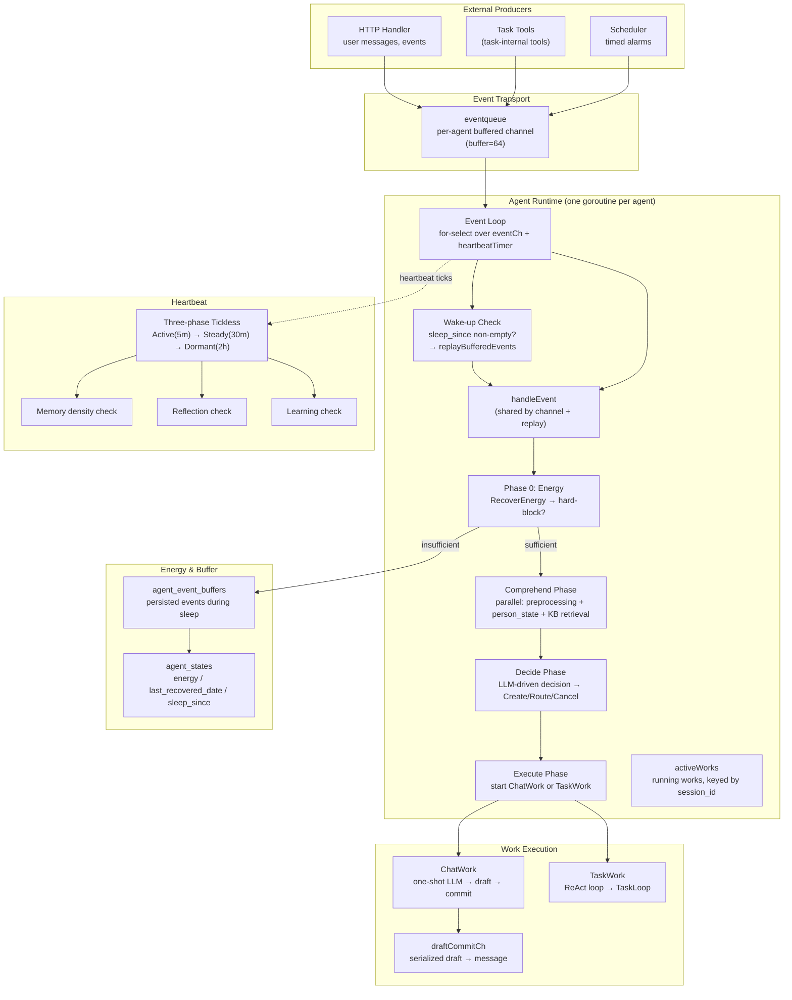

The runtime is a global singleton (`globalRuntimeManager` in manager.go). Each agent gets one `agentRuntime` with a dedicated goroutine running an event loop. The event loop processes one event at a time, serializing all agent work.

## Event Loop

The event loop is the heart of the runtime, running in a dedicated goroutine per agent:

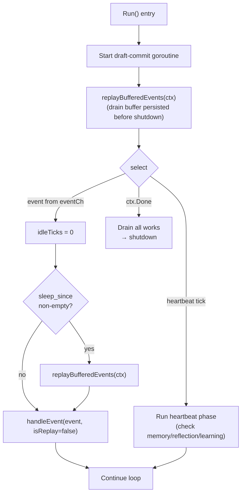

### `handleEvent` — unified event entry

Event handling logic is extracted into a single private method `handleEvent(ctx, event, isReplay bool) bool`, shared by both the channel-dispatch path and the buffer-replay path. The `isReplay` flag lets Comprehend add sleep-duration context to the prompt when the agent is catching up after being energy-depleted.

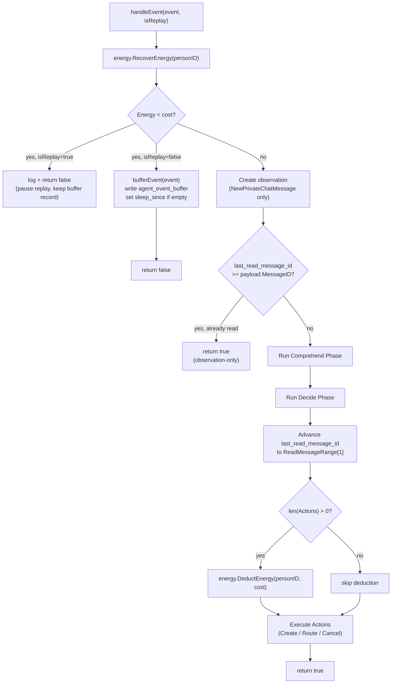

### Event handling flow

1. **Phase 0 — Energy**: `energy.RecoverEnergy(personID)` lazily applies daily recovery and returns the current `AgentState`. If `Energy < CostPassive (1)`:
   - **Replay path** (`isReplay=true`): log and `return false`. The current buffer record is NOT deleted, so replay pauses and resumes on the next wake-up.
   - **Channel path** (`isReplay=false`): `bufferEvent` serializes the event payload to `agent_event_buffers`, sets `sleep_since` to `now` if it was empty, and `return false`. The event is now durably persisted and will be replayed when energy recovers.

2. **Observation creation**: For `NewPrivateChatMessage`, `memory.CreateObservation` records the event in the agent's observation stream (used by EntityProfile generation). This happens before the read-skip check so that observations are always recorded even for already-read messages.

3. **Batched message skip**: For `NewPrivateChatMessage`, load `participant_session.LastReadMessageID`. If it is already `>= payload.MessageID`, the message was consumed by an earlier batch — return early (observation-only path). This collapses bursts of messages in the same session into a single Comprehend+Decide cycle: the first event queries and fixes the unread range via `ReadMessageRange`; subsequent events short-circuit here.

4. **Comprehend**: Runs the three-part parallel comprehension phase (preprocessing, person state inference, KB retrieval). Produces a `ComprehensionResult` that includes a fixed `ReadMessageRange [2]int64` boundary `[prev_last_read, current_max_message_id]`. See [context-engineering-pipeline.md](./context-engineering-pipeline.md).

5. **Decide**: The LLM (or rule-based logic for non-message events) produces a `DecisionResult` with zero or more `Actions`. Energy info is injected into the user prompt via `buildEnergyDynamicSuffix`. See [Decision Phase](#decision-phase).

6. **Advance `last_read_message_id`**: For `NewPrivateChatMessage`, after Decide returns, if `ReadMessageRange[1] > ReadMessageRange[0]`, advance `last_read_message_id` to `ReadMessageRange[1]`. This is **after** Decide (not before Comprehend) so that a failed Decide leaves the boundary in place for the next event to retry. Work execution is asynchronous — `last_read` does not wait for Work success.

7. **Energy deduction**: If `len(Actions) > 0`, call `energy.DeductEnergy(personID, CostPassive)`. Deduction failure is logged but does not roll back the decision (the decision is already in flight; bookkeeping failure is exposed via logs).

8. **Execute**: Each action is executed:
   - `ActionCreate`: creates a new Work (Chat or Task), adds it to `activeWorks`
   - `ActionRoute`: routes to an existing running TaskWork (via guidance channel)
   - `ActionCancel`: sends an appealable cancel directive to an existing TaskWork

### Event type routing

| Event Type | Source | Handling |
|---|---|---|
| `NewPrivateChatMessage` | User sends a message | Energy check → Create observation → Batch-skip check → Comprehend → Decide → Advance last_read → DeductEnergy → Execute |
| `WorkCompleted` | Work finishes (task loop or chat) | Energy check → Remove from activeWorks → Rule-based Decide → DeductEnergy → Execute |
| `Scheduled` | Alarm fires (heartbeat + alarm goroutine) | Energy check → Fast-path check → Comprehend → Rule-based Decide → DeductEnergy → Execute |
| `AlarmCreated` | `ActionCreateAlarm` from Decide | Energy check → AlarmRegistry registers goroutine → return |
| `GroupChatJoined` / `GroupChatLeft` / `SystemNotification` | System events | Direct return (no action) |

Note: fast-path (`Scheduled` + `ActionSendMessage`) bypasses Comprehend/Decide entirely and writes the pre-computed message directly. Per "Decide-phase-only" energy rule, fast-path and `AlarmCreated` do not deduct energy.

## Energy System

The energy system gives each agent a finite daily response budget, modeling cognitive fatigue and preventing runaway loops.

### State

Persisted in the `agent_states` table, keyed by `person_id` (energy belongs to the agent's identity, not its static `AgentConfig`):

| Field | Type | Description |
|---|---|---|
| `person_id` | int64 | FK to `persons` table (AI agent's identity), unique index |
| `energy` | int | Current energy, range `[0, 200]`, default 100 |
| `last_recovered_date` | text | `"YYYY-MM-DD"` in the global fixed timezone |
| `sleep_since` | text | RFC3339 timestamp marking sleep onset; empty when awake |

No foreign keys (per project rules) — relational integrity is enforced at the application layer.

### Constants

| Constant | Value | Meaning |
|---|---|---|
| `MaxEnergy` | 200 | Energy cap at any moment |
| `DailyRecovery` | 100 | Energy granted per day |
| `CostPassive` | 1 | Cost per Decide triggered by an eventqueue event |
| `CostActive` | 5 | Cost per Decide triggered by a heartbeat (active behavior path) |

### Global fixed timezone

Energy recovery is date-based, so a stable timezone is required. The timezone is a global singleton locked on first application startup:

- `energy.Init()` reads `<DATA_ROOT>/tz.txt`.
- If the file does not exist, detects the local IANA timezone (`TZ` env var → `/etc/localtime` symlink → `UTC` fallback) and writes it to the file.
- Subsequent startups reuse the file content regardless of OS timezone changes.
- `energy.Now()` / `energy.Today()` return the current time/date in this fixed timezone.

`Init` is called once at application startup, before any agent runtime is created. Failures fall back to UTC and are logged but non-fatal.

### Recovery (`RecoverEnergy`)

Lazy recovery — called at the start of every `handleEvent` and once during `createAgentRuntime` startup:

1. If no `agent_states` row exists, create one with `energy=100, last_recovered_date=today`.
2. If `last_recovered_date == today`, no-op (idempotent).
3. Otherwise, compute `days = today - last_recovered_date` and add `days * 100` energy, capped at `MaxEnergy`.
4. Update `last_recovered_date = today`.

The returned `*AgentState` snapshot is valid for the entire Decide cycle because the event loop is single-goroutine.

### Deduction (`DeductEnergy`)

Called by the event loop after Decide, only when `len(Actions) > 0`:

- Defensive check: if `energy < cost`, return `ErrInsufficientEnergy` and log (should not happen because Phase 0 pre-checks).
- Otherwise, `energy -= cost` and persist.
- Never lets energy go negative.

### Prompt injection

Energy info is injected into the Decide user prompt (no `system` role is used):

- **Static rules** (in `decidePromptTemplate`): daily budget, carry-over, 200 cap, "1 energy per response", and a warning that hitting zero makes the agent blind and silent until the next day.
- **Dynamic suffix** (`buildEnergyDynamicSuffix`): appended at the end of the user prompt:
  ```
  Current time: <2006-01-02 15:04:05 MST>
  Remaining energy: <N>. This response will cost 1 energy.
  ```
  - When `energy ≤ 15`: appends `Running low — choose carefully.`
  - When `energy ≤ 5`: appends `Critically low — spend only if absolutely necessary.`
  - Cost hint switches to "5 energy" for `TriggerSourceHeartbeat` (forward-compatible, no callers yet).

### Trigger source

`Decide` accepts a `TriggerSource` parameter that selects the energy cost and the cost hint shown in the prompt:

| Source | Cost | When |
|---|---|---|
| `TriggerSourceEvent` | 1 | Decide triggered by an eventqueue event |
| `TriggerSourceHeartbeat` | 5 | Decide triggered by a heartbeat autonomous-decide path |

## Event Buffer & Wake-up Recovery

When energy hits zero, the agent cannot perceive, reason, or respond. Events that arrive during this sleep period must not be lost — they are persisted to `agent_event_buffers` and replayed when energy recovers.

### Buffer storage

The `agent_event_buffers` table stores the full event payload:

| Field | Type | Description |
|---|---|---|
| `person_id` | int64 | Agent identity (composite index with `event_id`) |
| `event_type` | int | Runtime event type (`EventTypeNewPrivateChatMessage`, `EventTypeScheduled`, etc.) |
| `session_id` | int64 | Session the event belongs to |
| `event_id` | int64 | ID of the associated memory event (composite index with `person_id`) |
| `payload_json` | text | JSON-serialized event payload |

### Buffer path (hard-block)

When `handleEvent` detects insufficient energy on a channel event (not a replay):

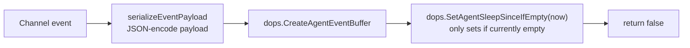

`sleep_since` is set only on the first buffered event after wake-up — it marks the onset of the sleep period and is used by the wake-up detector.

### Wake-up detection

Two detection points ensure no buffer is left undrained:

1. **Startup**: `Run()` calls `replayBufferedEvents(ctx)` once before entering the `for-select` loop. This drains any buffer persisted before the previous shutdown, without waiting for a new event to arrive.
2. **Per-event**: On every event from `eventCh`, the loop reads `sleep_since`. If non-empty, the agent just woke up — call `replayBufferedEvents(ctx)` before handling the new event.

### Replay (`replayBufferedEvents`)

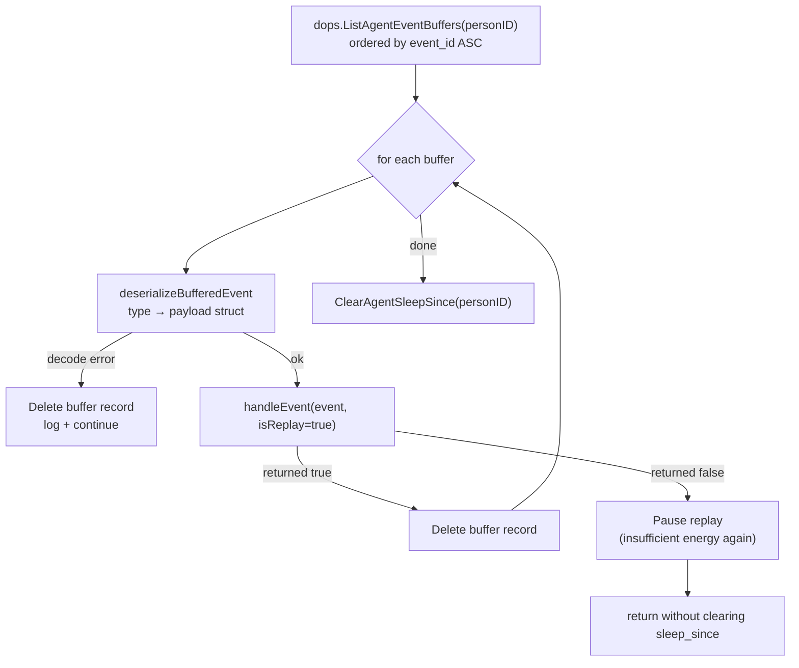

Key properties:
- **Order**: buffer records are replayed in `event_id ASC` order to preserve causal sequence.
- **Per-record acknowledgement**: a buffer record is deleted only after `handleEvent` returns `true`. If replay pauses mid-way (energy exhausted again), unprocessed records remain for the next wake-up.
- **Bad records**: payload decode failure, unsupported event type, or invalid JSON → log and delete the record (no retry) to avoid permanently blocking replay.
- **Sleep marker**: `sleep_since` is cleared only after the entire buffer drains successfully.
- **`isReplay=true`**: propagated to Comprehend so the prompt can include sleep-duration context.

### Replay vs. channel — non-duplication

A single event is processed exactly once. Channel dispatch and buffer replay are two entry points to the same `handleEvent`; an event that was buffered (because energy was zero when it arrived on the channel) is later replayed from the buffer and never re-dispatched from the channel. The observation table's `(person_id, event_id)` unique constraint provides additional idempotency — repeated consumption cannot produce duplicate observations.

## Comprehend Phase

The Comprehend phase runs three parallel tasks to understand the incoming event context. For full details, see [context-engineering-pipeline.md](./context-engineering-pipeline.md). The phase is structured as:

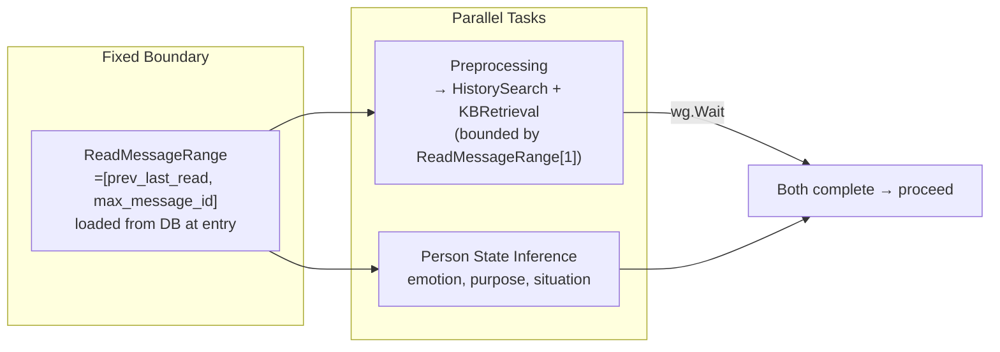

For `NewPrivateChatMessage`, Comprehend loads all unread messages in the fixed `ReadMessageRange` and formats them as the event description (not just the single triggering message). For non-message events, the full comprehension pipeline is skipped — `event.FormatDescription()` carries all the context Decide needs.

## Decide Phase

The Decide phase determines what action to take. It uses LLM-driven decision for `NewPrivateChatMessage` events, and rule-based decision for `WorkCompleted` and non-fast-path `Scheduled` events (which always trigger a ChatWork response):

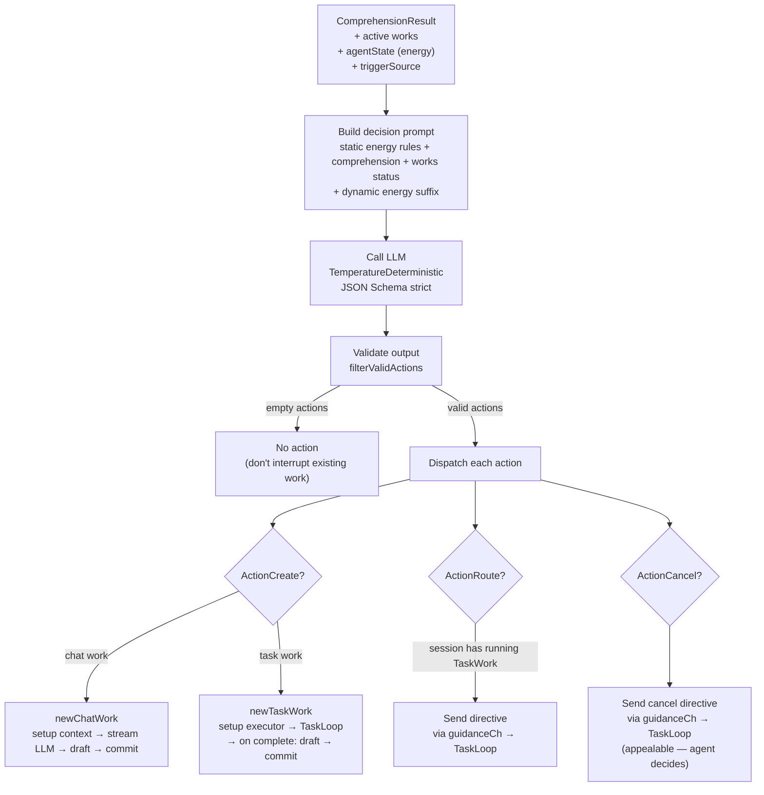

### Action types

| Action | Semantics | Implementation |
|---|---|---|
| `ActionCreate` | Start new work. Chat work for one-shot response; Task work for ReAct loop. | `newWork()` creates Work + Draft in a single transaction, then starts execution in a goroutine. |
| `ActionRoute` | Direct an existing running TaskWork toward a new objective. | Only routes to TaskWork (ChatWork has no loop to absorb the directive). Directive is sent via `guidanceCh`. |
| `ActionCancel` | Ask a running TaskWork to stop. | Appealable — not a forceful kill. Directive is sent via `guidanceCh`; the LLM decides how to wrap up. |

### Decision validation (`filterValidActions`)

The LLM output is validated defensively:
- Actions referencing non-existent or completed works are dropped
- Route/Cancel without a matching active TaskWork are dropped
- Route/Cancel targeting a ChatWork are dropped (ChatWork has no loop to absorb directives)
- If all actions are filtered out, the agent takes no action (silent no-op, not an error)

### Delivery target (0.1.3)

Chat works (WorkTypeChat) carry a `delivery_target` that controls where the message is delivered:

| Target | Semantics | Validation |
|---|---|---|
| `reply` (default) | Respond in the current event's session | Only valid for NewPrivateChatMessage events |
| `send_to_session` | Send to an existing session the agent participates in | Validates the agent is a participant via `IsParticipant` |
| `create_and_send` | Create a new 1v1 session and send the first message | Validates recipient exists and is not self; creates session via `CreateDirectSession` |

`reply` is for direct responses. `send_to_session` and `create_and_send` are for cross-session communication — e.g., "go ask B about X" triggers a `create_and_send` to B, optionally alongside a `reply` to acknowledge the requester.

### Cross-session comprehension stripping (0.1.3)

When a chat work targets a different session than the triggering event (`send_to_session` / `create_and_send`), the comprehension result is stripped to only `ActiveWorksSummary`. The original comprehension was computed against the event's session — its `ReadMessageRange`, `PersonState`, and partner identity refer to that session. Carrying them into a different session would contaminate the target session's context. The plan's `background` + `guidance` fields (written by the LLM during Decide) carry the necessary intent; the target session's own history is loaded fresh by `ExecuteChat`.

### Sessions context injection (0.1.3)

The Decide prompt includes the agent's full social picture via `buildSessionsContext`:
- All sessions the agent participates in (most recently active first)
- For each session: session ID, other participant names, EntityProfile narrative, and recent messages (up to N, each truncated to 200 chars)

This lets the LLM choose between `reply`, `send_to_session`, and `create_and_send` based on the agent's full social situation. No pre-filtering is applied — the agent sees everything and decides for itself which sessions are worth acting on. A companion section, `buildContactablePersonsContext`, lists all persons in the world (excluding self) with their IDs and names, enabling `create_and_send` to persons the agent has no existing session with.

### `trigger` field — causal semantic description

The legacy `triggerMessageID` (int64) has been replaced by `trigger` (string), a purely causal description used for traceability. It does **not** participate in data flow — it is not injected into prompts or used to load messages. Data flow is handled by `ReadMessageRange` and `TriggerOverride` in the chat pipeline.

`buildMetadata` constructs the trigger per event type:

| Event Type | trigger example |
|---|---|
| `NewPrivateChatMessage` | `Alice sent a chat message: "hello"` |
| `Scheduled` | (none — `SourceTypeScheduled` only) |
| `WorkCompleted` | `a previous work completed` |

## Work Lifecycle

Work is the unit of agent execution. There are two types:

### ChatWork

A one-shot LLM call that produces an agent response:

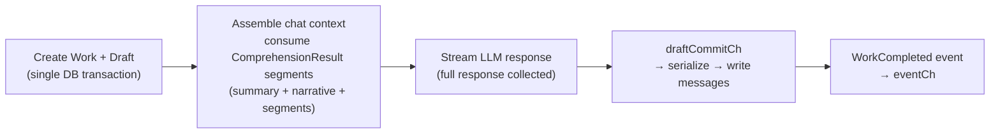

- Creates one Draft record for the response
- Uses `chat.ExecuteChat` with the `ComprehensionInput` assembled from the Comprehend phase — no redundant preprocessing, person-state inference, or KB retrieval
- On completion, sends the response content to `draftCommitCh` for serialized commit
- Fires `EventTypeWorkCompleted` back to the event loop

### TaskWork

A ReAct loop that runs tools to accomplish a goal:

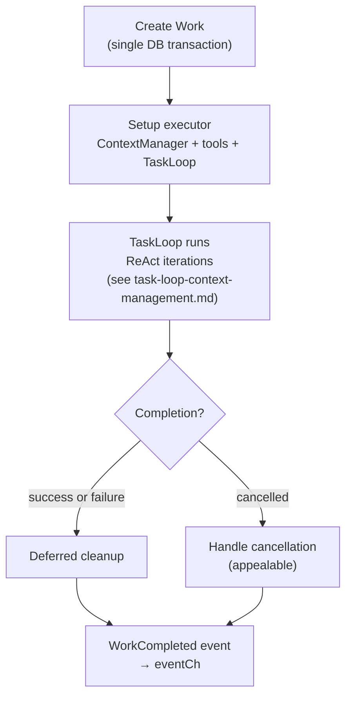

- Uses TaskLoop for ReAct execution (see [task-loop-context-management.md](./task-loop-context-management.md))
- Supports Guidance (directive injection from Decide) and Cancel (appealable, ChatWork falls back to abandon)

### Work ↔ Draft relationship

| Work Type | Draft created? | Draft committed? | Final output |
|---|---|---|---|
| ChatWork | Yes (at creation) | Yes (on completion) | Message in messages table + SSE push |
| TaskWork | **No** | — | Notes in notes.jsonl, files in workspace |

### Draft-based commit architecture

The `draftCommitCh` channel ensures serialized message commits:

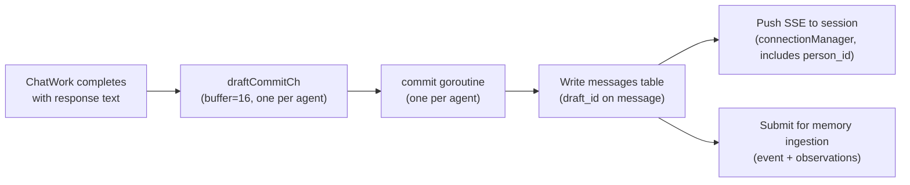

This design avoids the "placeholder message" anti-pattern (writing an empty placeholder, then updating it), and guarantees that messages across multiple concurrent ChatWorks are written in a predictable order.

### Active works management

- `activeWorks` is a slice of running works; works are identified by ID via `findActiveWorkByID`
- `hasActiveWorkInSession(sessionID)` checks whether any active work targets the given session
- Works are removed from `activeWorks` when their `WorkCompleted` event is processed

## Heartbeat System

The heartbeat mimics Linux's tickless kernel — the interval elongates as the agent becomes idle:

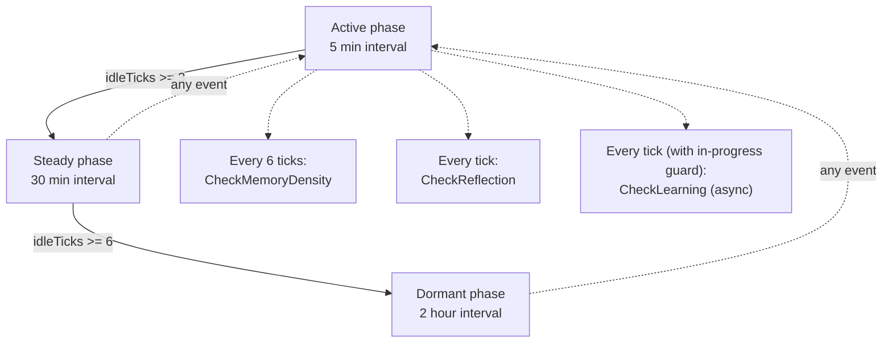

### Heartbeat checks

| Check | Frequency | What it does |
|---|---|---|
| `checkMemoryDensity` | Every 6 ticks | Calls `memory.CheckProfileDensity()` to trigger EntityProfile generation when observation density crosses threshold |
| `checkReflection` | Every tick | Calls `experience.CheckReflection()` to scan notes.jsonl for new insights |
| `checkLearning` | Every tick (with in-progress guard) | Calls `experience.CheckLearning()` to discover public experiences worth adopting |

The check functions are lightweight — they enqueue work asynchronously and return immediately. The heartbeat tick itself is fast, ensuring the event loop is never blocked by long-running reflection.

Heartbeat invokes Decide when the agent is idle and has Energy — this is the "autonomous-decide" path. The heartbeat grants the agent an opportunity to form an intention and act on it (e.g., start a conversation, set an alarm). If the agent decides to take no action (empty Actions list), no energy is deducted. The Decide prompt for heartbeat includes the agent's full session list (buildSessionsContext) and contactable persons (buildContactablePersonsContext), enabling proactive cross-session communication.

## Alarm System

Alarms implement the ActionCreateAlarm contract — the agent asks to be woken at a specific time. Formerly a TaskTool (wake_me_when), alarms are now a top-level Action decided in the Decide phase, reflecting that setting an alarm is a world action, not a workspace operation:

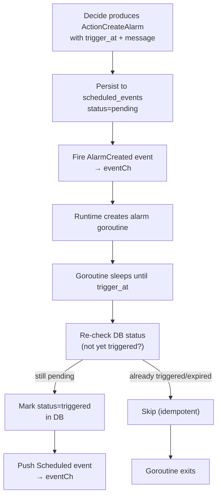

- Each alarm is a goroutine tracked in `alarmRegistry` keyed by `scheduledEventID`
- On runtime restart, `recoverOrphanAlarms` restores all pending alarms
- The goroutine uses `time.Until(triggerAT)` to sleep, then double-checks DB status before firing (prevents duplicate fires after restart + crash)
- `AlarmCreated` events are handled in `handleEvent` before the energy check — they register the alarm goroutine and return immediately, without deducting energy.

## Startup & Recovery

On application startup, the runtime manager performs recovery before starting agent goroutines:

1. **`energy.Init()`**: load/lock the global timezone from `<DATA_ROOT>/tz.txt`. Must run before any energy operation.
2. **Reset participant sessions**: all AI `participant_sessions` with `status=working` are reset to `idle` (crashed while working)
3. **Recover active works**: `recoverActiveWorks` marks running works as `Abandoned`, discards their drafts, resets participant status
4. **Start agent runtimes**: one `agentRuntime` per `agent_config`. Each runtime calls `energy.RecoverEnergy(personID)` once at construction (catch-up for the offline period).
5. **Recover scheduled events**: `recoverScheduledEvents` restores all `scheduled_events` with `status=pending` and `trigger_at` in the future
6. **Drain event buffer**: each runtime's `Run()` calls `replayBufferedEvents(ctx)` before entering the `for-select` loop, so events buffered before shutdown are processed as soon as energy is available.

### Work recovery

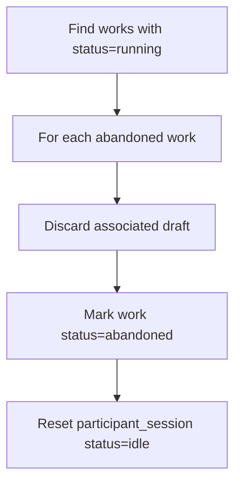

Works are not resumable after a crash. The design assumes:
- ChatWorks produce ephemeral responses (a new response is generated on next user message)
- TaskWorks leave their state in notes.jsonl and workspace files (the agent re-reads notes on next task)

## Configuration

| Config | Description | Relationship |
|---|---|---|
| `HeartbeatActiveInterval` | Tick interval when agent recently had events | Default 5 min |
| `HeartbeatSteadyAfter` | Consecutive empty ticks to enter steady phase | Default 3 |
| `HeartbeatSteadyInterval` | Tick interval in steady phase | Default 30 min |
| `HeartbeatDormantAfter` | Additional empty ticks to enter dormant phase | Default 6 |
| `HeartbeatDormantInterval` | Tick interval in dormant phase | Default 2 h |
| `energy.MaxEnergy` | Energy cap at any moment | 200 |
| `energy.DailyRecovery` | Energy granted per day | 100 |
| `energy.CostPassive` | Cost per eventqueue-triggered Decide | 1 |
| `energy.CostActive` | Cost per heartbeat-triggered Decide | 5 |

## Shutdown

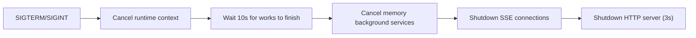

The 10-second grace period allows in-progress ChatWorks and TaskWorks to reach a natural stopping point. Works that don't finish in time are abandoned (state persists in DB for next startup recovery). Events that arrived during shutdown but were not yet processed remain in the channel; if they were already drained into `handleEvent`, the energy-check / buffer path persists them durably for the next startup's `replayBufferedEvents`.
