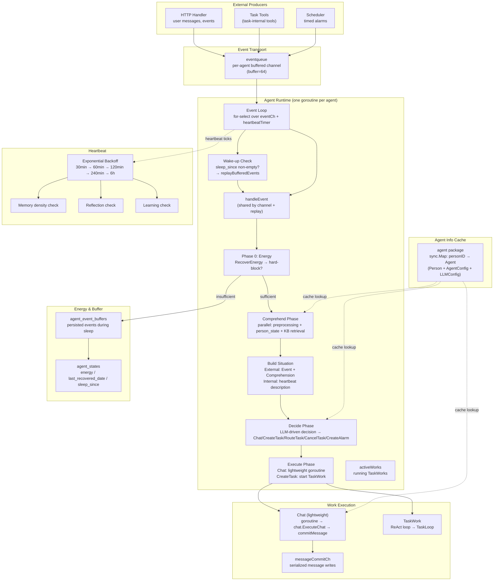
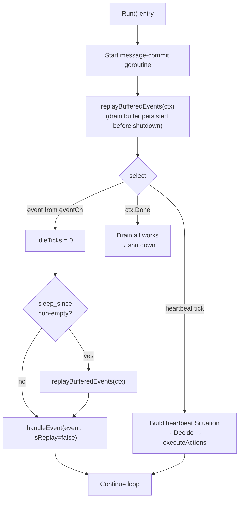
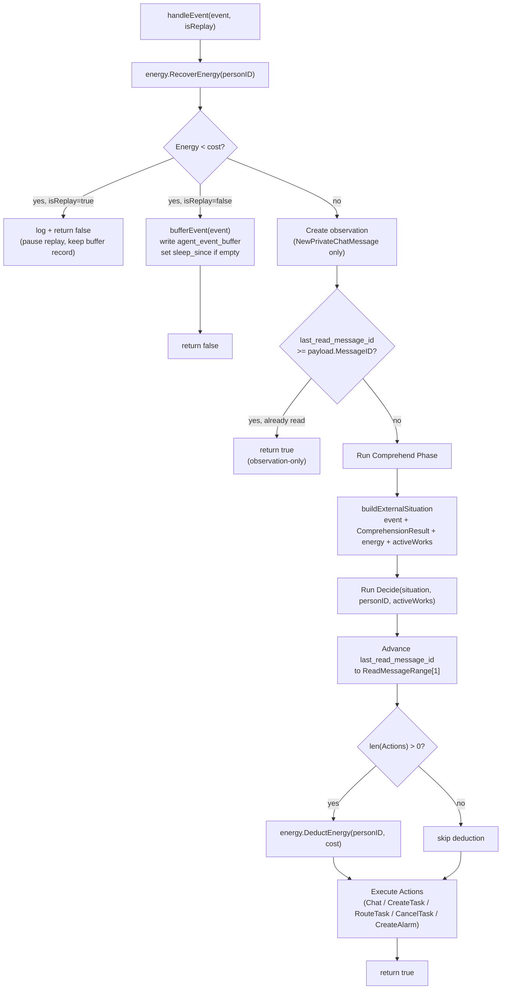
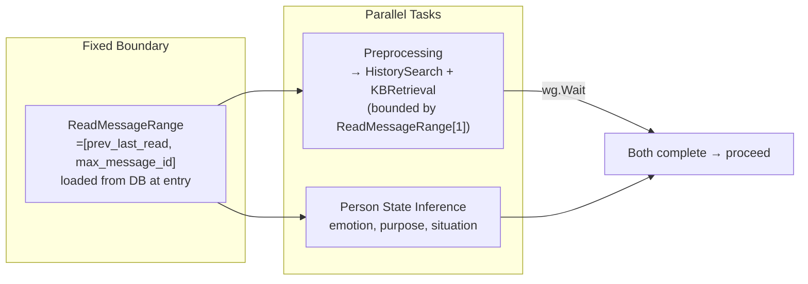
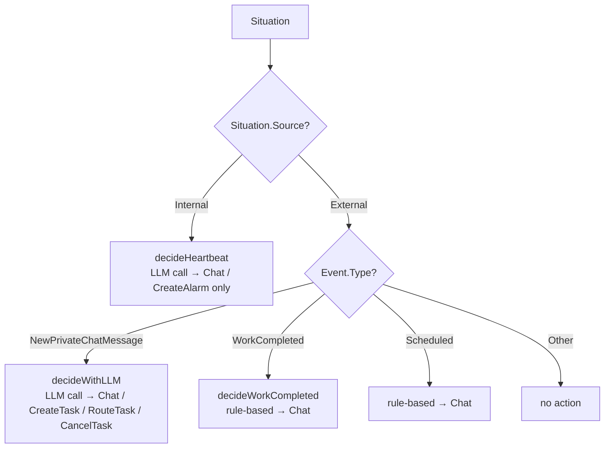
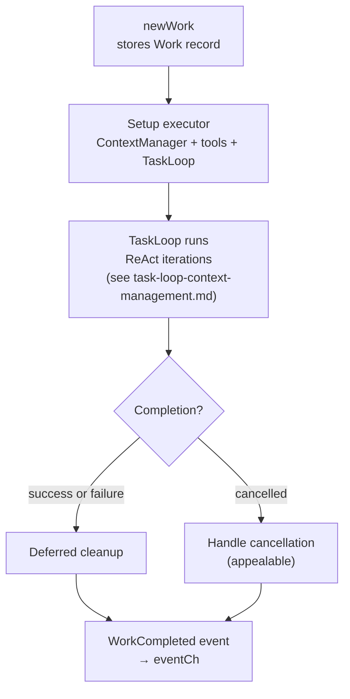
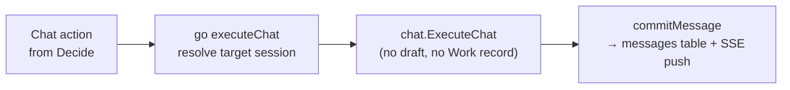
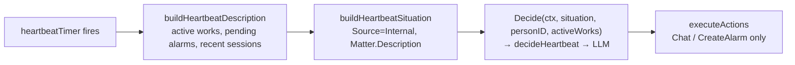
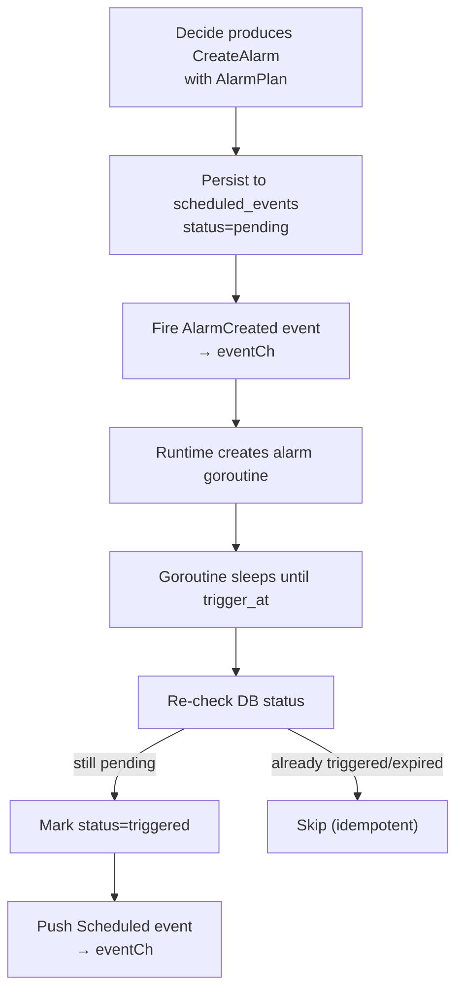
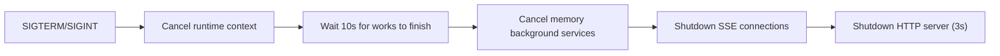

# Agent Runtime: Event Loop & Work Lifecycle — Engineering Implementation

This document describes how the agent runtime processes incoming events, transitions between Comprehend→Situation→Decide→Execute phases, and manages the lifecycle of Work (Task) and lightweight Chat actions. It also covers the energy budget system, the event-buffer recovery mechanism, and the agent info cache.

## Architecture Overview



The runtime is a global singleton (`globalRuntimeManager` in manager.go). Each agent gets one `agentRuntime` with a dedicated goroutine running an event loop. The event loop processes one event at a time, serializing all agent work.

## Agent Info Cache (`service/agent`)

The `agent` package caches Person, AgentConfig, and LLMConfig together to eliminate repeated DB queries on the hot path:

```go
type Agent struct {
    Person model.Person
    Config model.AgentConfig
    LLM    model.LLMConfig
}
```

- `agent.GetAgent(personID)` — loads from `sync.Map` cache; falls back to DB on miss.
- `agent.Refresh(personID)` — invalidates cache entry via async channel. Called from API handlers on CreateAgent / UpdateAgent / DeleteAgent / UpdateLLMConfig.

Usage principle: **fetch at point of use, don't hold or pass the pointer**. Each function that needs agent data calls `agent.GetAgent` itself. Passing `*Agent` between functions risks stale data if `Refresh` fires mid-flight (e.g., during an LLM call).

## Event Loop

The event loop is the heart of the runtime, running in a dedicated goroutine per agent:



### `handleEvent` — unified event entry

Event handling logic is extracted into a single private method `handleEvent(ctx, event, isReplay bool) bool`, shared by both the channel-dispatch path and the buffer-replay path.



### Event handling flow

1. **Phase 0 — Energy**: `energy.RecoverEnergy(personID)` lazily applies daily recovery and returns the current `AgentState`. If `Energy < cost`:
   - **Replay path** (`isReplay=true`): log and `return false`. The current buffer record is NOT deleted.
   - **Channel path** (`isReplay=false`): `bufferEvent` serializes the event payload to `agent_event_buffers`, sets `sleep_since` to `now` if it was empty, and `return false`.

2. **Observation creation**: For `NewPrivateChatMessage`, `memory.CreateObservation` records the event in the agent's observation stream. Happens before the read-skip check.

3. **Batched message skip**: For `NewPrivateChatMessage`, if `last_read_message_id >= payload.MessageID`, the message was consumed by an earlier batch — return early.

4. **Comprehend**: Runs the three-part parallel comprehension phase. Produces a `ComprehensionResult`. See [context-engineering-pipeline.md](./context-engineering-pipeline.md).

5. **Build Situation**: `buildExternalSituation(event, comprehension, energy, activeWorksSummary)` assembles a `Situation` DTO with `Source=External`, `Matter.Event`, and `Matter.Comprehension`. This unified DTO is the sole input to Decide.

6. **Decide**: `Decide(ctx, situation, personID, activeWorks)` produces a `DecisionResult`. For `NewPrivateChatMessage`, calls `decideWithLLM` which internally fetches agent info via `agent.GetAgent(personID)`. For rule-based paths (`WorkCompleted`, `Scheduled`), produces `ChatPlan` with guidance directly.

7. **Advance `last_read_message_id`**: After Decide returns, if `ReadMessageRange[1] > ReadMessageRange[0]`, advance `last_read_message_id` to `ReadMessageRange[1]`.

8. **Energy deduction**: If `len(Actions) > 0`, deduct energy. Cost depends on `Situation.Source` (External=1, Internal=5).

9. **Execute**: Each action is dispatched:
   - `Chat`: launches `go executeChat(ctx, situation, chatPlan)` — lightweight goroutine, no Work created
   - `CreateTask`: `newWork(situation, workPlan)` creates a TaskWork, adds to `activeWorks`
   - `RouteTask` / `CancelTask`: sends directive via `guidanceCh` to an existing active TaskWork
   - `CreateAlarm`: persists `ScheduledEvent` and registers alarm goroutine

### Event type routing

| Event Type | Source | Handling |
|---|---|---|
| `NewPrivateChatMessage` | User sends a message | Energy check → Create observation → Batch-skip check → Comprehend → buildExternalSituation → Decide → Advance last_read → DeductEnergy → Execute |
| `WorkCompleted` | Work finishes (task loop) | Energy check → Remove from activeWorks → Rule-based Decide (ChatPlan with guidance) → DeductEnergy → Execute |
| `Scheduled` | Alarm fires | Energy check → Fast-path check → Rule-based Decide (ChatPlan with guidance) → DeductEnergy → Execute |
| `AlarmCreated` | `CreateAlarm` action from Decide | Energy check → AlarmRegistry registers goroutine → return |
| `GroupChatJoined` / `GroupChatLeft` / `SystemNotification` | System events | Direct return (no action) |

Fast-path (`Scheduled` + `ActionSendMessage`) bypasses Comprehend/Decide entirely and writes the pre-computed message directly. Per "Decide-phase-only" energy rule, fast-path and `AlarmCreated` do not deduct energy.

## Energy System

The energy system gives each agent a finite daily response budget.

### State

Persisted in the `agent_states` table, keyed by `person_id`:

| Field | Type | Description |
|---|---|---|
| `person_id` | int64 | FK to `persons` table, unique index |
| `energy` | int | Current energy, range `[0, 200]`, default 100 |
| `last_recovered_date` | text | `"YYYY-MM-DD"` in the global fixed timezone |
| `sleep_since` | text | RFC3339 timestamp marking sleep onset; empty when awake |

### Constants

| Constant | Value | Meaning |
|---|---|---|
| `MaxEnergy` | 200 | Energy cap at any moment |
| `DailyRecovery` | 100 | Energy granted per day |
| `CostPassive` | 1 | Cost per external-event-triggered Decide |
| `CostActive` | 5 | Cost per heartbeat-triggered Decide |

### Global fixed timezone

Energy recovery is date-based. The timezone is a global singleton locked on first application startup via `energy.Init()` which reads `<DATA_ROOT>/tz.txt`.

### Recovery (`RecoverEnergy`)

Called at the start of every `handleEvent` and once during `createAgentRuntime` startup. Lazily applies daily recovery: if `last_recovered_date != today`, add `days * 100` energy, capped at `MaxEnergy`, and update `last_recovered_date`.

### Deduction (`DeductEnergy`)

Called after Decide, only when `len(Actions) > 0`. Deducts `cost` from energy, never lets it go negative.

### Prompt injection

- **Static rules** (in `decidePromptTemplate`): daily budget, carry-over, 200 cap, cost per response.
- **Dynamic suffix** (`buildEnergyDynamicSuffix`): current time, remaining energy, cost hint. Adds warnings at low thresholds (≤15 / ≤5).

### Situation source → cost mapping

| Source | Cost | When |
|---|---|---|
| `SituationSourceExternal` | 1 | Decide triggered by an eventqueue event |
| `SituationSourceInternal` | 5 | Decide triggered by a heartbeat |

## Event Buffer & Wake-up Recovery

When energy hits zero, events are persisted to `agent_event_buffers` and replayed when energy recovers.

### Buffer storage

| Field | Type | Description |
|---|---|---|
| `person_id` | int64 | Agent identity |
| `event_type` | int | Runtime event type |
| `session_id` | int64 | Session the event belongs to |
| `event_id` | int64 | ID of the associated memory event |
| `payload_json` | text | JSON-serialized event payload |

### Buffer path (hard-block)

When `handleEvent` detects insufficient energy: serialize payload → `CreateAgentEventBuffer` → `SetAgentSleepSinceIfEmpty(now)` → return false.

### Wake-up detection

Two detection points:
1. **Startup**: `Run()` calls `replayBufferedEvents(ctx)` before entering the `for-select` loop.
2. **Per-event**: On every event from `eventCh`, if `sleep_since` is non-empty, call `replayBufferedEvents(ctx)` before handling the new event.

### Replay (`replayBufferedEvents`)

- Buffers replayed in `event_id ASC` order.
- Each record deleted only after `handleEvent` returns `true`.
- Bad records (decode failure) are deleted with log, no retry.
- `sleep_since` cleared only after entire buffer drains.
- `isReplay=true` propagated to Comprehend.

## Comprehend Phase

The Comprehend phase runs three parallel tasks to understand the incoming event context. For full details, see [context-engineering-pipeline.md](./context-engineering-pipeline.md).



For `NewPrivateChatMessage`, Comprehend loads all unread messages in the fixed `ReadMessageRange`. For non-message events, the full pipeline is skipped — `event.FormatDescription()` carries the context.

## Situation — Unified Decide Input

Between Comprehend and Decide, the runtime builds a `Situation` DTO that is the sole cognitive input to Decide:

```go
type Situation struct {
    Source  SituationSource  // External (event) or Internal (heartbeat)
    Subject SituationSubject // Energy + active works summary
    Matter  SituationMatter  // Event + Comprehension (external) or Description (internal)
}
```

**External path**: `event + ComprehensionResult + energy + activeWorksSummary → buildExternalSituation → Decide`

**Internal (heartbeat) path**: `heartbeat self-observation → buildHeartbeatSituation → Decide`

The heartbeat does NOT go through Comprehend and does NOT create a fake event. It observes runtime facts (active works, pending alarms, recent conversations) and writes a natural-language description into `Matter.Description`. `Matter.Event` and `Matter.Comprehension` remain nil.

## Decide Phase



### Action types

| Action | Semantics | Implementation |
|---|---|---|
| `Chat` | Send a chat message. Does NOT create a Work. | `go executeChat()` → `chat.ExecuteChat` → `commitMessage`. ChatPlan carries guidance + session target. |
| `CreateTask` | Start a new multi-step TaskWork with ReAct loop. | `newWork()` creates Work, starts goroutine via `go w.Run(ctx)`. |
| `RouteTask` | Route to an existing active TaskWork. | Directive sent via `guidanceCh`. Only routes to TaskWork. |
| `CancelTask` | Request an active TaskWork to stop. | Appealable — not forceful. Directive via `guidanceCh`. |
| `CreateAlarm` | Set a future alarm. | Persists `ScheduledEvent`, registers alarm goroutine. |

### ChatPlan — delivery target encoding

Chat actions carry a `ChatPlan` that encodes the delivery target:

```go
type ChatPlan struct {
    Guidance          string // Internal intention, first-person
    SessionID         int64  // >0: existing session; -1: new 1v1 session; 0: illegal
    RecipientPersonID int64  // Required when SessionID == -1
}
```

- `SessionID > 0` — send to the specified existing session.
- `SessionID == -1` — create a new 1v1 session with `RecipientPersonID`.
- `SessionID == 0` — always illegal (Go zero value, indistinguishable from missing field in LLM JSON).

`UseNewSession()` helper: `return plan.SessionID < 0`.

### Decision validation (`filterValidActions`)

- Actions referencing non-existent or completed works are dropped.
- Route/Cancel without a matching active TaskWork are dropped.
- Route/Cancel targeting a non-TaskWork are dropped.
- Chat actions with `session_id == 0` are dropped (illegal).
- Chat actions with `session_id == -1` must have valid `recipient_person_id`.
- If all actions are filtered out, the agent takes no action.

### Sessions context injection

The Decide prompt includes the agent's full social picture via `buildSessionsContext` (all sessions, participant names, EntityProfile narratives, recent messages) and `buildContactablePersonsContext` (all persons in the world). This lets the LLM choose between replying in the current session, continuing an existing conversation, or starting a new one — all encoded via `session_id` in the `ChatPlan`.

### `trigger` field — causal semantic description

`buildMetadata` constructs a trigger string per event type for traceability purposes. It is NOT injected into prompts or used to load messages.

## Work Lifecycle

### TaskWork

The only Work type. A ReAct loop that runs tools to accomplish a goal:



- Uses TaskLoop for ReAct execution (see [task-loop-context-management.md](./task-loop-context-management.md))
- Supports Guidance (directive injection from Decide) and Cancel (appealable)
- `runTask` fetches agent info via `agent.GetAgent` at the point of use, then passes `LLMConfig` and `PersonID` to `task.RunTask`

### Chat — lightweight action

Chat is NOT a Work. It is a lightweight goroutine that calls `chat.ExecuteChat` and commits the result directly:



- No Work record, no draft, no `WorkCompleted` event.
- `executeChat` fetches agent info via `agent.GetAgent` right before calling `chat.ExecuteChat`.
- Message commits are serialized through `messageCommitCh`.

### Active works management

- `activeWorks` holds only TaskWorks (Chat actions don't create works).
- `hasActiveWorkInSession(sessionID)` checks whether any active work targets the given session.
- Works are removed from `activeWorks` when their `WorkCompleted` event is processed.

## Heartbeat System

The heartbeat uses exponential backoff starting from `heartbeatBase` (30min). Each subsequent idle heartbeat doubles the interval, capped at `heartbeatMax` (6h):

```
tick 1 → 30min, tick 2 → 60min, tick 3 → 120min, tick 4 → 240min, tick 5+ → 360min
```

Any external event resets `idleTicks` to 0, restarting from 30min.

### Heartbeat → Decide flow

Heartbeats do NOT go through Comprehend or the event queue. The flow is:



Heartbeat Decide is restricted to `Chat` and `CreateAlarm` actions — no task creation or routing from autonomous heartbeats.

### Heartbeat checks

| Check | Frequency | What it does |
|---|---|---|
| `checkMemoryDensity` | Every 6 ticks | Triggers EntityProfile generation when observation density crosses threshold |
| `checkReflection` | Every tick | Scans notes.jsonl for new insights |
| `checkLearning` | Every tick (with in-progress guard) | Discovers public experiences worth adopting |

## Alarm System

Alarms implement the `CreateAlarm` action — the agent asks to be woken at a specific time:



- Each alarm is a goroutine tracked in `alarmRegistry`.
- On runtime restart, `recoverOrphanAlarms` restores all pending alarms.
- `AlarmCreated` events are handled before the energy check — they register the alarm goroutine and return immediately.

## Startup & Recovery

1. **`energy.Init()`**: load/lock the global timezone from `<DATA_ROOT>/tz.txt`.
2. **Reset participant sessions**: all AI `participant_sessions` with `status=working` reset to `idle`.
3. **Recover active works**: `recoverActiveWorks` marks running works as `Abandoned`, resets participant status.
4. **Start agent runtimes**: one `agentRuntime` per `agent_config`. Each runtime calls `energy.RecoverEnergy(personID)` at construction.
5. **Recover scheduled events**: `recoverScheduledEvents` restores pending alarms.
6. **Drain event buffer**: each runtime's `Run()` calls `replayBufferedEvents(ctx)` before entering the loop.

### Work recovery

Abandoned works are marked `abandoned` and their participant sessions reset to `idle`. Works are not resumable after a crash — TaskWorks leave state in notes.jsonl and workspace files, so the agent can re-read context on the next task.

## Configuration

| Config | Description | Default |
|---|---|---|
| `heartbeatBase` | First heartbeat interval after an external event | 30 min |
| `heartbeatMax` | Maximum heartbeat interval (exponential backoff cap) | 6 h |
| `energy.MaxEnergy` | Energy cap at any moment | 200 |
| `energy.DailyRecovery` | Energy granted per day | 100 |
| `energy.CostPassive` | Cost per external-event-triggered Decide | 1 |
| `energy.CostActive` | Cost per heartbeat-triggered Decide | 5 |

## Shutdown



The 10-second grace period allows in-progress TaskWorks to reach a natural stopping point. Chat goroutines are lightweight and complete quickly.
