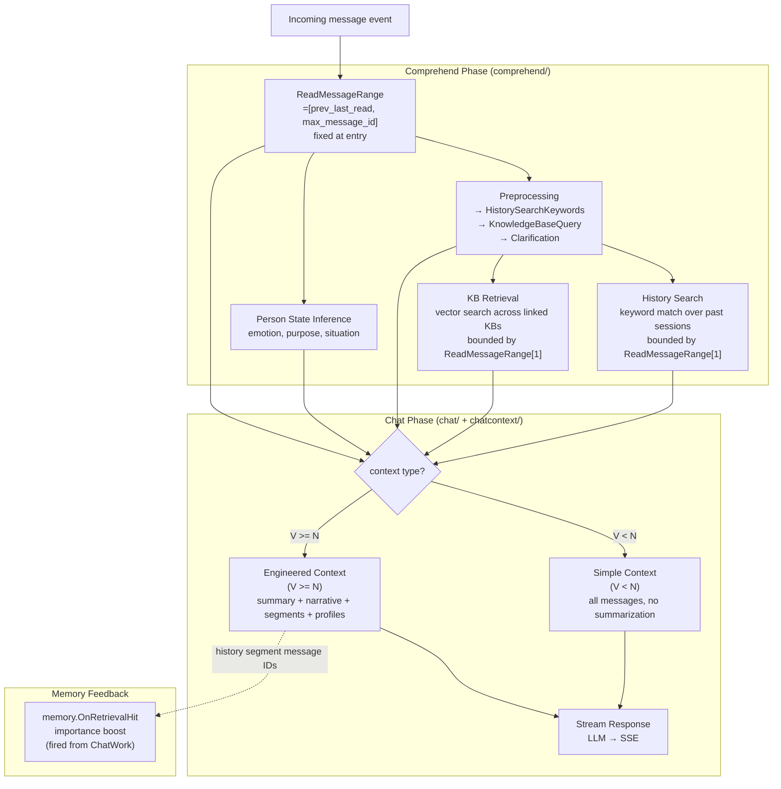
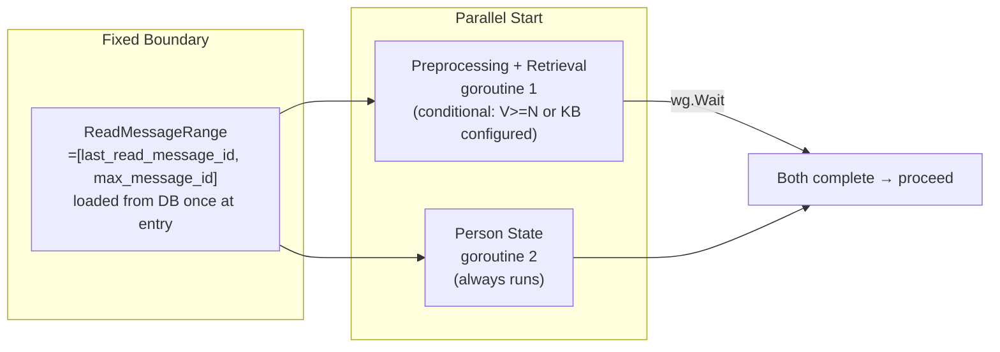
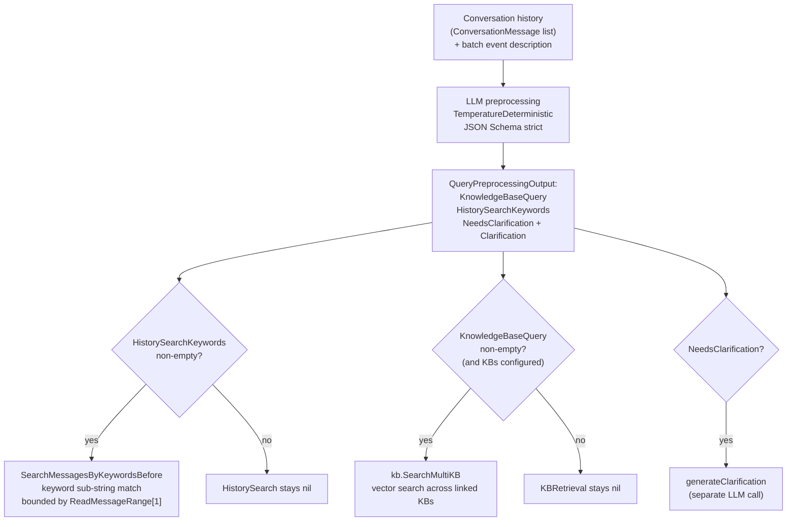
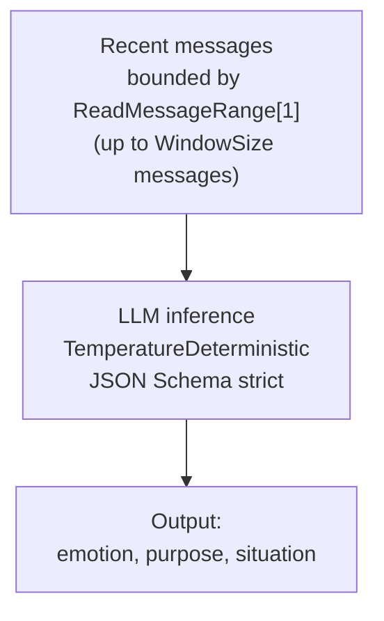
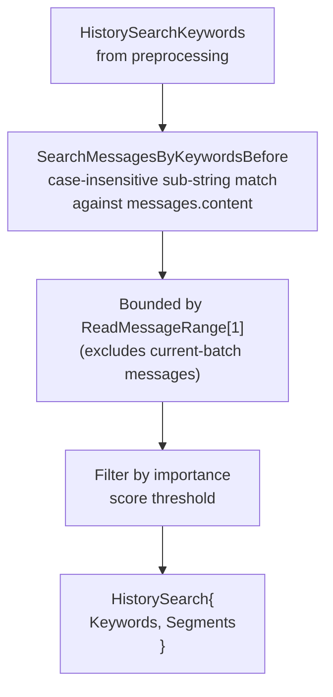
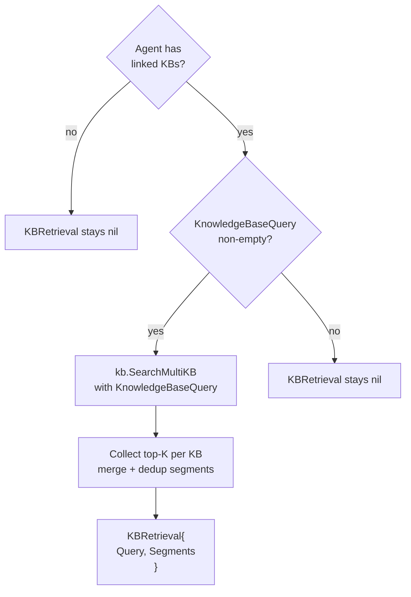
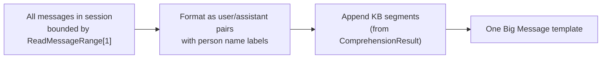
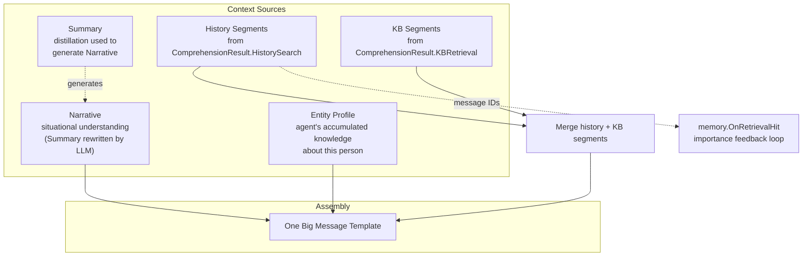
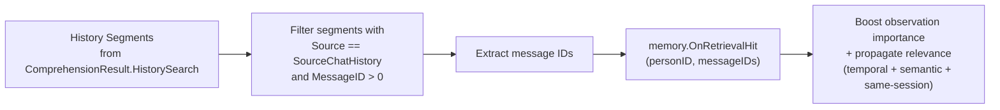

# Context Engineering Pipeline — Engineering Implementation

This document describes how the chat context is assembled for LLM consumption. It covers the Comprehend phase (understanding the user input, including batched message handling and retrieval), the Chat phase (assembling the prompt context from comprehension results), and how they interoperate.

## Architecture Overview



The pipeline has two phases: Comprehend (run before Decide) produces understanding plus retrieval results, and Chat (run by ChatWork) consumes that understanding to build the LLM prompt. Retrieval (chat-history keyword search and KB vector search) lives entirely in Comprehend; Chat only assembles context from the segments Comprehend produced.

## Comprehend Phase

The Comprehend phase runs in the event loop before Decide. It loads a fixed message boundary, then runs two parallel sub-tasks (Preprocessing with retrieval, and Person State inference):



### Fixed boundary: `ReadMessageRange`

For `NewPrivateChatMessage`, Comprehend reads two values from the DB at entry:

- `prev_last_read` = `participant_session.LastReadMessageID` (the agent's read position before this event)
- `current_max` = `GetMaxMessageID(sessionID)` (the latest message ID in the session)

These form `ReadMessageRange [2]int64{prev_last_read, current_max}`. The range is **fixed for the entire Comprehend+Decide+ChatWork cycle** — messages that arrive after Comprehend starts are excluded from this batch and will be handled by the next event. This guarantees Comprehend, Decide, and ChatWork all see the same message set.

The event loop advances `last_read_message_id` to `ReadMessageRange[1]` **after** Decide returns (see [agent-runtime-event-loop.md](./agent-runtime-event-loop.md)). If Decide fails, `last_read` is not advanced, leaving the boundary in place for the next event to retry.

### Batched message loading

For `NewPrivateChatMessage`, Comprehend calls `dops.ListMessagesInRange(sessionID, prev_last_read, current_max)` to load all unread messages in the fixed range, then formats them via `formatMessageRange`:

```
[Private chat]
Alice [2026-08-05 14:30:01]: hello
Alice [2026-08-05 14:30:05]: are you there?
Bob [2026-08-05 14:30:10]: hey Alice
```

This batch description replaces the single-message `event.FormatDescription()` for `NewPrivateChatMessage`. Non-message events (WorkCompleted, Scheduled, etc.) still use `event.FormatDescription()` and skip the full comprehension pipeline — there is no "other party" to understand.

### 1. Preprocessing + Retrieval

Preprocessing runs conditionally — only when `MessageCount >= WindowSize` (context engineering needed) or when the agent has linked KBs (KB retrieval needed). It runs as a single goroutine that produces both retrieval requests and executes them:



The output (`QueryPreprocessingOutput`) directly produces retrieval instructions — there is no longer an intermediate `QueryType` classification or `ProcessedQuery` field exposed to downstream. The preprocessing either requests retrieval (keywords / KB query) or flags the batch as needing clarification; downstream code acts on these directives without re-interpreting classification state.

### 2. Person State Inference

Runs independently to infer the other person's current state:



- Temperature is deterministic (0) because this is a classification task, not creative generation
- Inferred emotion, purpose, and situation are injected into the Decide prompt as natural-language context, helping the LLM choose an appropriate response strategy
- The former NeedsWorldInteraction boolean has been removed — Decide now judges whether a task is needed directly from the event content, avoiding a redundant cross-layer signal
- Recent messages for inference are loaded with `id <= ReadMessageRange[1]` as the upper bound, so person-state inference sees the same boundary as preprocessing.

### 3. History Search

Keyword-based retrieval from the agent's past sessions, executed inside the preprocessing goroutine:



- Uses the keywords extracted during preprocessing (not the full query)
- Performs case-insensitive sub-string matching against `messages.content` in past sessions
- **Upper bound** is `ReadMessageRange[1]`: messages from the current batch are excluded from history search, so the same message cannot appear both as "current batch" and as "retrieved history"
- After segments are selected, ChatWork calls `memory.OnRetrievalHit()` with the segment message IDs — this feeds the importance boost back into the memory system (see [Memory Feedback Loop](#memory-feedback-loop))

### 4. KB Retrieval

Vector search across the agent's linked KBs, also executed inside the preprocessing goroutine:



Uses `kb.SearchMultiKB` to search across all linked KBs concurrently. Each search produces top-K results; results from all KBs are merged.

### `HistorySearch` / `KBRetrieval` semantics

The two retrieval results use pointer-to-struct semantics to distinguish "not executed" from "executed but empty":

| State | `HistorySearch` | `KBRetrieval` |
|---|---|---|
| Not executed (no keywords / no KB query / no KB configured) | `nil` | `nil` |
| Executed, no hits | non-`nil`, `Segments` empty | non-`nil`, `Segments` empty |
| Executed, with hits | non-`nil`, `Segments` populated | non-`nil`, `Segments` populated |

This tri-state lets ChatWork distinguish "search would not help" from "search found nothing" — useful for context assembly decisions.

### `ConversationMessage` — domain message format

History messages within Comprehend use the domain struct `ConversationMessage`, not `llm.Message`:

```go
type ConversationMessage struct {
    PersonID   int64
    PersonName string
    Content    string
    CreatedAt  time.Time
}
```

This preserves the sender's identity (person ID + name) and timestamp throughout preprocessing. `llm.Message` (with `user`/`assistant` roles) is only constructed at the LLM gateway boundary — preprocessing history is rendered as `"{PersonName} [{Timestamp}]: {Content}"` lines. This avoids prematurely collapsing multi-party context into a binary role sequence.

### `ComprehensionResult` structure

```go
type ComprehensionResult struct {
    ReadMessageRange      [2]int64         // Fixed boundary [prev_last_read, max_message_id]
    EventDescription      string           // Batch description (multiple messages) or single-event description
    HistorySearch         *HistorySearch   // nil = not executed; non-nil empty = no hits
    KBRetrieval           *KBRetrieval     // nil = not executed; non-nil empty = no hits
    NeedsClarification    bool             // From preprocessing; query too vague
    Clarification         string           // Generated clarification question
    PersonState           *PersonState     // Inferred emotion, purpose, situation
    ActiveWorksSummary    string           // Natural-language summary of running works (self-awareness)
}

type HistorySearch struct {
    Keywords []string
    Segments []Segment
}

type KBRetrieval struct {
    Query    string
    Segments []Segment
}
```

The legacy fields `QueryType`, `ProcessedQuery`, `SkipRetrieval`, and the cross-layer `PreprocessingResult` have been removed. Preprocessing now produces retrieval directives directly (keywords + KB query), and downstream code acts on the resulting `HistorySearch` / `KBRetrieval` without re-interpreting intermediate classification state.

### A2A session partner resolution (0.1.3)

In agent-to-agent sessions, the "other party" is another agent, not the human user. The comprehension and chat pipelines resolve the conversation partner dynamically via `GetSessionOtherParticipant(sessionID, selfPersonID)`, which returns the participant other than `selfPersonID`. This replaces the former hardcoded human-user assumption (`GetCurrentUserPersonID`) that broke A2A dialogs — both participants would have been labeled as the human user.

The resolved partner name flows through:
- **Comprehend**: `InferPersonState` and `formatRecentMessages` use the partner name for role labeling
- **Chat**: `AssembleContext` uses the partner name for dialog formatting
- **Summary**: `formatMessagesForSummaryGeneric` resolves each sender's actual name from the persons table, avoiding the former "Assistant" label for all non-human messages

## Chat Phase — Consumes ComprehensionResult

ChatWork receives a `ComprehensionInput` assembled from the `ComprehensionResult` (plus `Guidance` from Decide, plus `TaskResult` for post-task chat). ChatWork does **not** perform preprocessing, person-state inference, KB retrieval, or history search — all of these were done in Comprehend. It goes directly to context assembly and response streaming.

The chat phase chooses between two context assembly strategies based on message volume:

```
if message_count < window_size:
    → Simple Context (direct dump, no summarization)
else:
    → Engineered Context (summary + narrative + retrieval + profiles)
```

This bifurcation exists because:
- **Simple**: When the conversation is short, all messages fit in the context window. Summarization would add latency without benefit.
- **Engineered**: When the conversation is long, directly dumping all messages would overflow the context window. Engineered context distills the essential information.

### Simple Context (`V < N`)



- All messages are included verbatim, with `id <= ReadMessageRange[1]` as upper bound
- Person name labels distinguish speakers in multi-agent sessions
- KB segments from `ComprehensionResult.KBRetrieval.Segments` are appended (history segments are not used in simple context — short conversations don't need history retrieval)
- No summarization, no narrative — just the raw conversation plus any KB hits

### Engineered Context (`V >= N`)



#### Summary

Generated periodically when the conversation exceeds the window. The LLM distills key topics, decisions, and context from messages beyond the visible window. The raw summary text is not injected directly into the prompt — instead, it is rewritten by the LLM into a first-person "Narrative" (below), which is what actually appears in the context.

#### Narrative

When the message count exceeds the window size threshold, the comprehension summary is injected into the chat context as a "narrative" paragraph — describing what the agent knows about the conversation so far. This bridges the gap between older conversation history and the current visible messages.

#### Segments (from ComprehensionResult)

ChatWork merges `HistorySearch.Segments` and `KBRetrieval.Segments` into a single `relevantSegments` list for context assembly. The merge preserves source information (`SourceChatHistory` vs `SourceKnowledgeBase`) so the assembly template can format them appropriately.

ChatWork does **not** re-execute keyword search or KB retrieval — it only consumes what Comprehend already produced.

#### Entity Profiles

The agent's accumulated EntityProfile for the current user (from `memory.LoadProfileForEntity`) is injected as a short paragraph:

```
Your impression of {user_name}:
{narrative}
```

This gives the LLM personalized context without needing to re-derive it from raw messages.

### One Big Message Template

All dynamic context (whether simple or engineered) is packed into a **single user message** sent to the LLM:

```
## Context
{Summary section (if engineered)}
{Narrative section (if engineered)}
{Chat History section (if engineered)}
{KB Results section (if engineered)}
{Entity Profile section (if engineered)}

{User's Message}
**{sender_name}**: {content}
```

### Trigger Override

When the event source is a scheduled alarm (the agent's own `wake_me_when`), the trigger message loaded at `ReadMessageRange[1]` is rewritten before context assembly:

```
Original alarm text: "Remind me to check the report at 3pm"
At trigger time → "[ALARM NOTIFICATION] An alarm you set has just triggered. This is NOT a new request — you set this alarm yourself earlier. Take action now based on your self-reminder below.

Your self-reminder: {alarm message text}

[Original message for reference: {original alarm text}]"
```

This prevents the LLM from misinterpreting the trigger as a new user request — it frames it as "you asked to be reminded of this, here it is."

The trigger message is loaded from `ReadMessageRange[1]` (the upper bound of the fixed batch boundary). This is a pipeline-level mechanism, separate from the `trigger` causal-description field in task metadata (see [agent-runtime-event-loop.md](./agent-runtime-event-loop.md)).

## Memory Feedback Loop

When the Engineered Context path uses chat-history segments retrieved by Comprehend, ChatWork triggers the memory feedback loop:



Note the split responsibility:
- **Retrieval** happens in Comprehend (via `SearchMessagesByKeywordsBefore`)
- **Feedback** is fired from ChatWork's `assembleEngineeredContext` (only in the V >= N branch)

This split exists because the feedback should only fire when the segments are actually used in the response context — if Comprehend retrieved segments but ChatWork took the Simple Context path (V < N, no history segments used), no feedback is sent. The feedback call is fire-and-forget — it launches background goroutines for relevance propagation and returns immediately.

This creates a closed loop: the more a past event is retrieved and used in context, the more important it becomes, and the more likely it is to be retrieved again in the future. Combined with daily decay, this implements a natural "use it or lose it" memory model.

## Configuration

| Config | Description | Default |
|---|---|---|
| `MessageWindow` (N) | Threshold for switching from Simple to Engineered context | 50 |
| `SegmentsTopK` | Number of chat history segments to retrieve | Configurable via agent config |
| `KBTopK` (`kb.DefaultSearchTopK`) | Number of KB segments to include per KB | 5 |
| `EntityProfileThreshold` | Minimum observations for profile generation | 10 |

## Key Design Decisions

1. **Retrieval lives in Comprehend, not Chat**: Both chat-history keyword search and KB vector retrieval are "completing the understanding of the current unread batch." They belong with comprehension. ChatWork only consumes the resulting segments — it never executes retrieval itself. This eliminates duplicate retrieval calls and ensures Decide sees the same context ChatWork will use.

2. **`ReadMessageRange` fixes the batch boundary**: Comprehend, Decide, and ChatWork all use the same `[prev_last_read, current_max]` boundary. Messages arriving after Comprehend starts are excluded from this batch and handled by the next event. This guarantees understanding, decision, and response are based on the same message set.

3. **`last_read` advances after Decide**: The read position is updated to `ReadMessageRange[1]` only after Decide returns, so a failed Decide leaves the boundary in place for retry. Work execution is asynchronous — `last_read` does not wait for Work success.

4. **Batched message understanding**: Consecutive unread messages in a session are understood and decided as one bounded batch. The first event in a burst triggers full Comprehend+Decide; subsequent events in the same session short-circuit via `last_read_message_id >= payload.MessageID` and only create observations.

5. **Narrative is separate from Summary**: Summary is about what happened (factual), Narrative is about what the agent knows and is doing (contextual). They serve different purposes and are composed independently.

6. **Entity Profiles as prose, not JSON**: Profiles are stored as narrative paragraphs and injected as markdown text. This is simpler for the LLM to consume than structured JSON and more natural in the prompt flow.

7. **No distinct `chat` vs `task` context engines**: The same `chat.ExecuteChat` function handles both use cases. When called from a TaskWork's deferred cleanup, the narrative section is populated with the task's final summary.

8. **`ConversationMessage` preserves identity**: History messages within Comprehend use a domain struct that keeps person ID, name, and timestamp. `llm.Message` (with user/assistant roles) is only constructed at the LLM gateway boundary, preventing premature collapse of multi-party context.

9. **Memory Feedback is fire-and-forget**: The `OnRetrievalHit` call does not block the chat pipeline. It launches background goroutines for relevance propagation and returns immediately.
