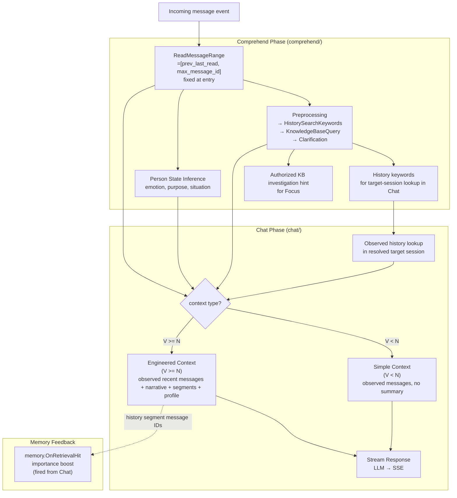
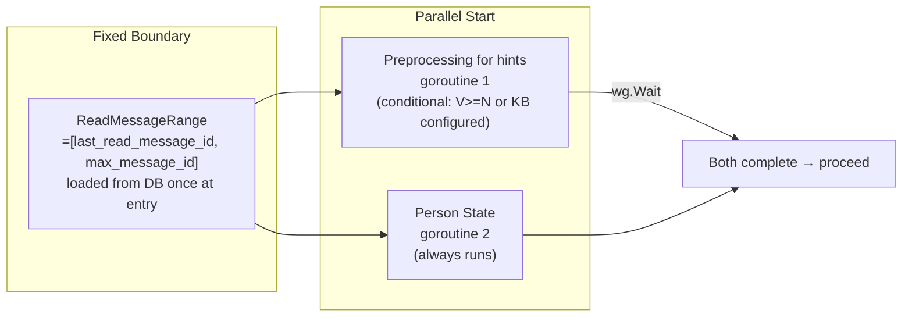
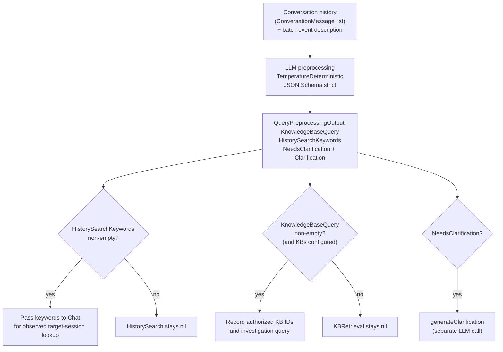
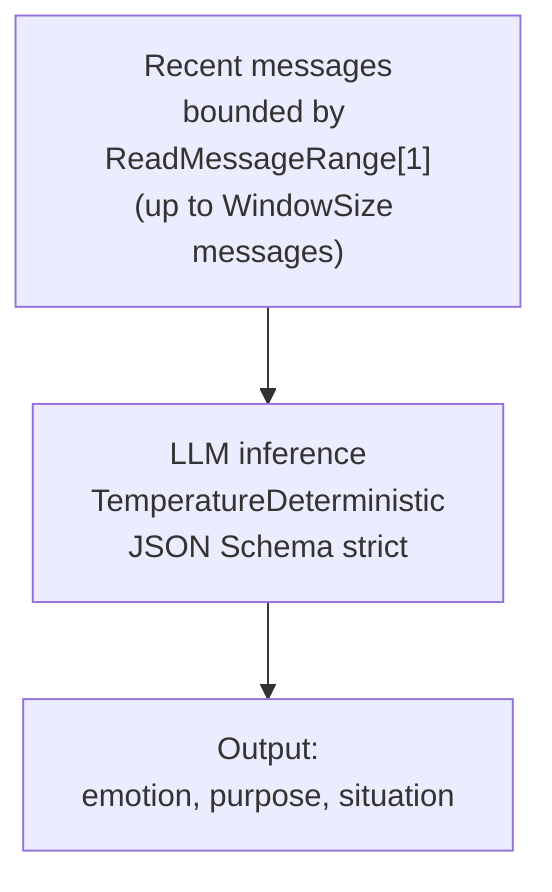
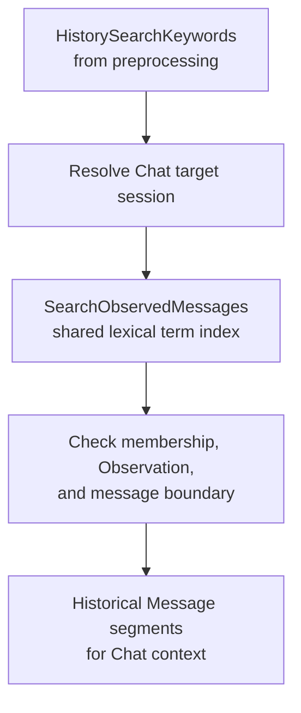
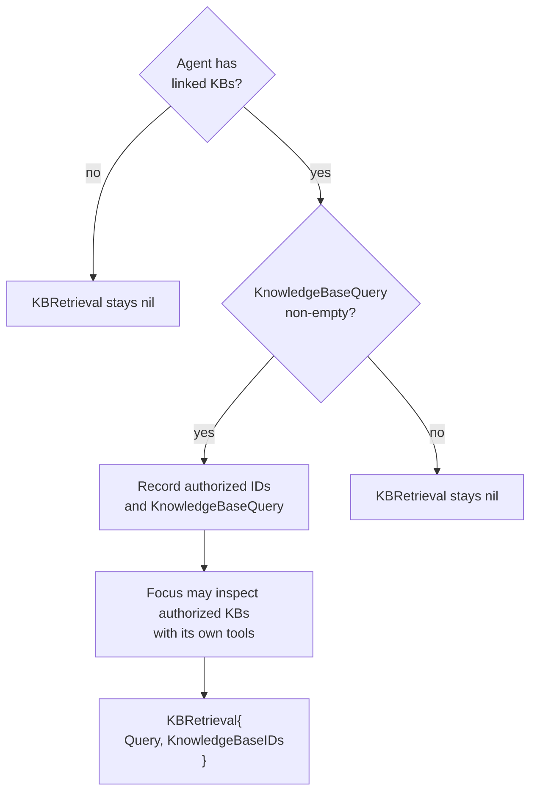
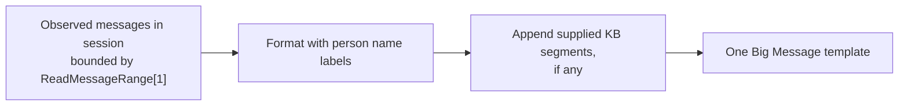
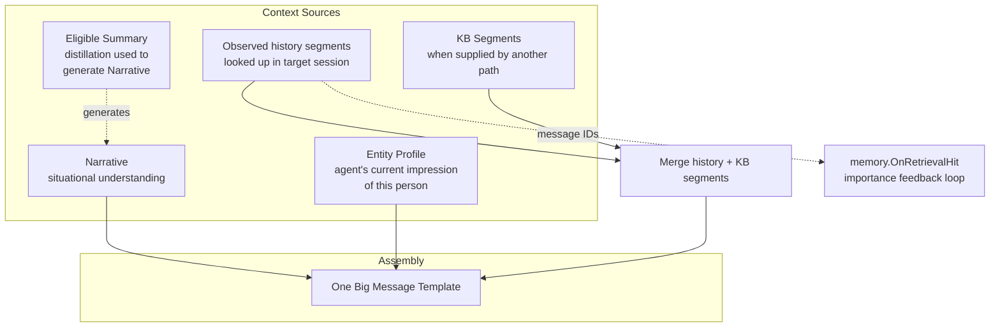
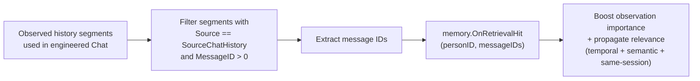

# Context Engineering Pipeline — Engineering Implementation

This document describes how the chat context is assembled for LLM consumption. It covers the Comprehend phase (understanding the user input, including batched message handling and retrieval), the Chat phase (assembling the prompt context from comprehension results), and how they interoperate.

## Architecture Overview


```mermaid
graph TB
    subgraph "Comprehend Phase (comprehend/)"
        Range["ReadMessageRange<br/>=[prev_last_read, max_message_id]<br/>fixed at entry"]
        Preproc["Preprocessing<br/>→ HistorySearchKeywords<br/>→ KnowledgeBaseQuery<br/>→ Clarification"]
        PersonState["Person State Inference<br/>emotion, purpose, situation"]
        HistorySearch["History keywords<br/>for target-session lookup in Chat"]
        KBRetrieval["Authorized KB investigation hint<br/>for Focus"]
    end

    subgraph "Chat Phase (chat/)"
        TargetSearch["Observed history lookup<br/>in resolved target session"]
        Assembly{"context type?"}
        Simple["Simple Context<br/>(V < N)<br/>observed messages, no summary"]
        Engineered["Engineered Context<br/>(V >= N)<br/>observed recent messages + narrative + segments + profile"]
        Stream["Stream Response<br/>LLM → SSE"]
    end

    subgraph "Memory Feedback"
        OnHit["memory.OnRetrievalHit<br/>importance boost<br/>(fired from Chat)"]
    end

    Event["Incoming message event"] --> Range
    Range --> Preproc
    Range --> PersonState
    Preproc --> HistorySearch
    Preproc --> KBRetrieval
    HistorySearch --> TargetSearch
    TargetSearch --> Assembly
    Range --> Assembly
    Preproc --> Assembly
    PersonState --> Assembly
    Assembly -->|V < N| Simple
    Assembly -->|V >= N| Engineered
    Simple --> Stream
    Engineered --> Stream
    Engineered -.history segment message IDs.-> OnHit
```

Comprehend (before Decide) produces an understanding of the incoming batch, a bounded observed same-session window, history keywords, and any authorized KB investigation hint. Decide receives these with its `Situation` and may separately use read-only recall tools. Chat resolves its target session, performs an observed history lookup there when given keywords, and assembles the reply context. KB investigation is performed through Focus rather than a Comprehend-time vector search.

## Comprehend Phase

The Comprehend phase runs in the event loop before Decide. It loads a fixed message boundary, then runs two parallel sub-tasks (Preprocessing for hints, and Person State inference):


```mermaid
flowchart LR
    subgraph "Fixed Boundary"
        R["ReadMessageRange<br/>=[last_read_message_id, max_message_id]<br/>loaded from DB once at entry"]
    end
    subgraph "Parallel Start"
        direction LR
        A["Preprocessing for hints<br/>goroutine 1<br/>(conditional: V>=N or KB configured)"]
        B["Person State<br/>goroutine 2<br/>(always runs)"]
    end
    R --> A
    R --> B
    A -->|wg.Wait| Join["Both complete → proceed"]
    B --> Join
```

### Fixed boundary: `ReadMessageRange`

For `NewPrivateChatMessage`, Comprehend reads two values from the DB at entry:

- `prev_last_read` = `participant_session.LastReadMessageID` (the agent's read position before this event)
- `current_max` = `GetMaxMessageID(sessionID)` (the latest message ID in the session)

These form `ReadMessageRange [2]int64{prev_last_read, current_max}`. This fixes the incoming batch for Comprehend and Decide. Chat uses the relevant boundary and observed records for its resolved target session; asynchronous execution can overlap with later arrivals. A new message is not silently added to an already accepted decision.

The runtime persists an accepted Decision, its Actions, and the advancement of `last_read_message_id` to `ReadMessageRange[1]` in one transaction (see [agent-runtime-event-loop.md](./agent-runtime-event-loop.md)). A failed or rejected decision does not advance the read boundary.

### Batched message loading

For `NewPrivateChatMessage`, Comprehend calls `dops.ListMessagesInRange(sessionID, prev_last_read, current_max)` to load all unread messages in the fixed range, then formats them via `formatMessageRange`:

```
[Private chat]
Alice [2026-08-05 14:30:01]: hello
Alice [2026-08-05 14:30:05]: are you there?
Bob [2026-08-05 14:30:10]: hey Alice
```

This batch description replaces the single-message `event.FormatDescription()` for `NewPrivateChatMessage`. Comprehend also returns the exact IDs it read, so the runtime can record only those Message Events as this agent's Observations. Non-message events use their event-specific comprehension path without chat-specific person-state inference.

### 1. Preprocessing + Retrieval

Preprocessing runs conditionally — when `MessageCount >= WindowSize` or the agent has linked KBs. It produces history keywords and, when appropriate, a KB investigation hint. History lookup waits until Chat knows the target session; Focus owns deeper KB inspection:


```mermaid
flowchart TD
    Input["Conversation history<br/>(ConversationMessage list)<br/>+ batch event description"] --> LLM["LLM preprocessing<br/>TemperatureDeterministic<br/>JSON Schema strict"]
    LLM --> Output["QueryPreprocessingOutput:<br/>KnowledgeBaseQuery<br/>HistorySearchKeywords<br/>NeedsClarification + Clarification"]
    Output --> KW{"HistorySearchKeywords<br/>non-empty?"}
    KW -->|yes| Search["Pass keywords to Chat<br/>for observed target-session lookup"]
    KW -->|no| NoHistory["HistorySearch stays nil"]
    Output --> KBQ{"KnowledgeBaseQuery<br/>non-empty?<br/>(and KBs configured)"}
    KBQ -->|yes| KBS["Record authorized KB IDs<br/>and investigation query"]
    KBQ -->|no| NoKB["KBRetrieval stays nil"]
    Output --> Clar{"NeedsClarification?"}
    Clar -->|yes| GenClar["generateClarification<br/>(separate LLM call)"]
```

The output (`QueryPreprocessingOutput`) supplies hints and possible clarification, rather than pre-read history or KB evidence. The former `QueryType` and `ProcessedQuery` fields are not part of the downstream comprehension contract.

### 2. Person State Inference

Runs independently to infer the other person's current state:


```mermaid
flowchart TD
    Input["Recent messages<br/>bounded by ReadMessageRange[1]<br/>(up to WindowSize messages)"] --> LLM["LLM inference<br/>TemperatureDeterministic<br/>JSON Schema strict"]
    LLM --> Output["Output:<br/>emotion, purpose, situation"]
```

- Temperature is deterministic (0) because this is a classification task, not creative generation
- Inferred emotion, purpose, and situation are injected into the Decide prompt as natural-language context, helping the LLM choose an appropriate response strategy
- The former NeedsWorldInteraction boolean has been removed — Decide now judges whether a task is needed directly from the event content, avoiding a redundant cross-layer signal
- Recent messages for inference are loaded with `id <= ReadMessageRange[1]` as the upper bound, so person-state inference sees the same boundary as preprocessing.

### 3. History Search

Preprocessing supplies lexical hints. After the Chat Action's target session is known, Chat searches observed messages in that session through the shared term index:


```mermaid
flowchart TD
    KW["HistorySearchKeywords<br/>from preprocessing"] --> Target["Resolve Chat target session"]
    Target --> Search["SearchObservedMessages<br/>shared lexical term index"]
    Search --> Bound["Check membership, Observation,<br/>and message boundary"]
    Bound --> Output["Historical Message segments<br/>for Chat context"]
```

- Uses the keywords extracted during preprocessing (not the full query)
- Searches the resolved target session under membership and Observation checks. Hints from the triggering session do not carry raw snippets into another target session.
- The engineered Chat context omits duplicates of recent messages. Historical segments selected for that context are eligible for `memory.OnRetrievalHit()` before final assembly (see [Memory Feedback Loop](#memory-feedback-loop)).

### 4. KB Retrieval

Comprehend can identify a possible need to investigate authorized KBs, but it does not retrieve KB content in this path:


```mermaid
flowchart TD
    HasKB{"Agent has<br/>linked KBs?"}
    HasKB -->|no| NoOp["KBRetrieval stays nil"]
    HasKB -->|yes| Query{"KnowledgeBaseQuery<br/>non-empty?"}
    Query -->|yes| Search["Record authorized IDs<br/>and KnowledgeBaseQuery"]
    Query -->|no| NoKB["KBRetrieval stays nil"]
    Search --> Filter["Focus may inspect authorized KBs<br/>with its own tools"]
    Filter --> Output["KBRetrieval{<br/>  Query, KnowledgeBaseIDs<br/>}"]
```

This hint is separate from the KB evidence a Focus loop may later retrieve. A query or authorized KB ID is not itself evidence from the documents.

### `HistorySearch` / `KBRetrieval` semantics

These optional fields carry hints, not evidence that a search ran:

| State | `HistorySearch` | `KBRetrieval` |
|---|---|---|
| No hint | `nil` | `nil` |
| Hint supplied | `Keywords` for Chat's target-session lookup | `Query` and authorized `KnowledgeBaseIDs` for possible Focus inspection |

A hint does not imply that a source was inspected or that a missing result proves absence.

### `ConversationMessage` — domain message format

History messages within Comprehend use the domain struct `ConversationMessage`, not `llm.Message`:

```go
type ConversationMessage struct {
    ID         int64
    PersonID   int64
    PersonName string
    Content    string
    CreatedAt  time.Time
    OwnAction  *MessageActionContext // Only this agent's recorded Chat intention
}
```

This preserves the sender's identity and timestamp. For this agent's own outgoing messages, `OwnAction` can expose the originating Action's background, reason, and guidance; another speaker's private Action is not exposed. `llm.Message` roles are constructed at the LLM gateway boundary, preserving named participants in domain context.

### `Comprehension` structure

```go
type Comprehension struct {
    Type             ComprehensionType
    EventDescription string
    Chat             *ChatComprehension
}

type ChatComprehension struct {
    ReadMessageRange [2]int64
    ReadMessageIDs   []int64
    HistorySearch    *HistorySearch
    KBRetrieval      *KBRetrieval
    PersonState      *PersonState
    Narrative        string
    RecentMessages   []ConversationMessage
}

type HistorySearch struct { Keywords []string }
type KBRetrieval struct {
    Query            string
    KnowledgeBaseIDs []int64
    Segments         []Segment // Legacy/direct retrieval path only
}
```

`Comprehension` is the event-wide wrapper; `ChatComprehension` carries chat-only details. General ongoing Work and Action summaries belong to `Situation.Subject`. `ReadMessageIDs` is the exact batch used to write Observations; a numeric interval alone is insufficient because message IDs are global.

### A2A session partner resolution (0.1.3)

In agent-to-agent sessions, the "other party" is another agent, not the human user. The comprehension and chat pipelines resolve the conversation partner dynamically via `GetSessionOtherParticipant(sessionID, selfPersonID)`, which returns the participant other than `selfPersonID`. This replaces the former hardcoded human-user assumption (`GetCurrentUserPersonID`) that broke A2A dialogs — both participants would have been labeled as the human user.

The resolved partner name flows through:
- **Comprehend**: `InferPersonState` and `formatRecentMessages` use the partner name for role labeling
- **Chat**: `AssembleContext` uses the partner name for dialog formatting
- **Summary**: `formatMessagesForSummaryGeneric` resolves each sender's actual name from the persons table, avoiding the former "Assistant" label for all non-human messages

## Chat Phase — Consumes ChatComprehension Hints

Chat receives context derived from `ChatComprehension` (plus `Guidance` from Decide and any Focus result). It does not repeat preprocessing or person-state inference. If history keywords are present, it searches observed messages **after** resolving its target session, then assembles context and streams the response. Deeper KB inspection belongs to Focus.

The chat phase chooses between two context assembly strategies based on message volume:

```
if message_count < window_size:
    → Simple Context (direct dump, no summarization)
else:
    → Engineered Context (summary + narrative + retrieval + profiles)
```

This bifurcation exists because:
- **Simple**: When the conversation is short, all messages fit in the context window. Summarization would add latency without benefit.
- **Engineered**: When the conversation is long, directly dumping all messages would overflow the context window. Engineered context distills the essential information.

### Simple Context (`V < N`)


```mermaid
flowchart LR
    Messages["Observed messages in session<br/>bounded by ReadMessageRange[1]"] --> Format["Format with person name labels"]
    Format --> Segments["Append supplied KB segments,<br/>if any"]
    Segments --> Prompt["One Big Message template"]
```

- Only observed messages within the boundary are included verbatim
- Person name labels distinguish speakers in multi-agent sessions
- Supplied KB segments, if any, can be appended; the regular Comprehend KB hint is not a document result. History segments are not used in simple context.
- No summarization, no narrative — just the raw conversation plus any KB hits

### Engineered Context (`V >= N`)


```mermaid
graph TB
    subgraph "Context Sources"
        Summary["Eligible Summary<br/>distillation used to<br/>generate Narrative"]
        ChatHistory["Observed history segments<br/>looked up in target session"]
        Narrative["Narrative<br/>situational understanding"]
        Segments["KB Segments<br/>when supplied by another path"]
        EntityProfile["Entity Profile<br/>agent's current impression<br/>of this person"]
    end

    subgraph "Assembly"
        Template["One Big Message Template"]
    end

    ChatHistory --> Merge["Merge history + KB segments"]
    Segments --> Merge
    Merge --> Template
    Narrative --> Template
    EntityProfile --> Template
    Summary -.generates.-> Narrative

    ChatHistory -.message IDs.-> OnRetrievalHit["memory.OnRetrievalHit<br/>importance feedback loop"]
```

#### Summary

Generated periodically when the conversation exceeds the window. The LLM distills key topics, decisions, and context from messages beyond the visible window. The raw summary text is not injected directly into the prompt — instead, it is rewritten by the LLM into a first-person "Narrative" (below), which is what actually appears in the context.

#### Narrative

When the message count exceeds the window size threshold, the comprehension summary is injected into the chat context as a "narrative" paragraph — describing what the agent knows about the conversation so far. This bridges the gap between older conversation history and the current visible messages.

#### Segments (from target-session lookup or supplied context)

Chat merges observed target-session history segments and any supplied KB segments into `relevantSegments`, preserving source information (`SourceChatHistory` vs `SourceKnowledgeBase`). The regular Comprehend KB hint does not contain document segments.

Chat performs the deferred target-session history lookup; it does not perform KB vector retrieval in this path.

#### Entity Profiles

The agent's accumulated EntityProfile for the current user (from `memory.LoadProfileForEntity`) is injected as a short paragraph:

```
Your impression of {user_name}:
{narrative}
```

This gives the LLM personalized context without needing to re-derive it from raw messages.

### One Big Message Template

All dynamic context (whether simple or engineered) is packed into a **single user message** sent to the LLM:

```
## Context
{Summary section (if engineered)}
{Narrative section (if engineered)}
{Chat History section (if engineered)}
{KB Results section (if engineered)}
{Entity Profile section (if engineered)}

{User's Message}
**{sender_name}**: {content}
```

### Trigger Override

When the event source is a scheduled alarm (the agent's own `wake_me_when`), the trigger message loaded at `ReadMessageRange[1]` is rewritten before context assembly:

```
Original alarm text: "Remind me to check the report at 3pm"
At trigger time → "[ALARM NOTIFICATION] An alarm you set has just triggered. This is NOT a new request — you set this alarm yourself earlier. Take action now based on your self-reminder below.

Your self-reminder: {alarm message text}

[Original message for reference: {original alarm text}]"
```

This prevents the LLM from misinterpreting the trigger as a new user request — it frames it as "you asked to be reminded of this, here it is."

The trigger message is loaded from `ReadMessageRange[1]` (the upper bound of the fixed batch boundary). This is a pipeline-level mechanism, separate from the `trigger` causal-description field in task metadata (see [agent-runtime-event-loop.md](./agent-runtime-event-loop.md)).

## Memory Feedback Loop

When the Engineered Context path selects observed history segments from its target session, Chat triggers the memory feedback loop before final prompt assembly:


```mermaid
flowchart LR
    Segments["Observed history segments<br/>used in engineered Chat"] --> Filter["Filter segments with<br/>Source == SourceChatHistory<br/>and MessageID > 0"]
    Filter --> MsgIDs["Extract message IDs"]
    MsgIDs --> OnRetrievalHit["memory.OnRetrievalHit<br/>(personID, messageIDs)"]
    OnRetrievalHit --> Boost["Boost observation importance<br/>+ propagate relevance<br/>(temporal + semantic + same-session)"]
```

Note the split responsibility:
- **History hint generation** happens in Comprehend; the observed target-session lookup happens in Chat.
- **Feedback** is fired from Chat's `assembleEngineeredContext` (only in the V >= N branch)

This split places feedback at the point where Chat has selected historical segments for the longer response context. If Chat takes the Simple Context path, no history-segment feedback is sent. `OnRetrievalHit` updates matching Observation scores synchronously, then starts association propagation in background goroutines. A later assembly or generation failure does not undo that update.

This creates a limited feedback loop for EntityProfile evidence selection: qualifying Chat history use can increase an existing Observation's importance, while maintenance decreases unreinforced scores. The lexical lookup itself does not rank by importance, and Decide recall neither reads nor writes this score as a gate.

## Configuration

| Config | Description | Default |
|---|---|---|
| `MessageWindow` (N) | Threshold for switching from Simple to Engineered context | 50 |
| `SegmentsTopK` | Number of chat history segments to retrieve | Configurable via agent config |
| `KBTopK` (`kb.DefaultSearchTopK`) | Number of KB segments to include per KB | 5 |
| `EntityProfileThreshold` | Minimum observations for profile generation | 10 |

## Key Design Decisions

1. **Comprehend produces hints; Chat reads its target session**: Preprocessing and person-state inference belong with understanding the incoming batch. Chat does its observed history lookup after the target session is resolved. Decide has a separate read-only recall loop for broader history, and Focus handles KB investigation.

2. **`ReadMessageRange` fixes the incoming batch**: Comprehend and Decide use the same `[prev_last_read, current_max]` boundary. Asynchronous Chat uses a bounded, observed context for its target session; later messages can arrive before that Action finishes.

3. **`last_read` advances with an accepted Decision**: The read position is updated to `ReadMessageRange[1]` in the transaction that persists its Decision and Actions. A failed decision leaves the boundary in place. Work and Chat execution are asynchronous.

4. **Batched message understanding**: Consecutive unread messages in a session are understood and decided as one bounded batch. The runtime writes Observations for the exact message IDs Comprehend read. Subsequent events for those messages short-circuit via `last_read_message_id >= payload.MessageID` without inventing new experience.

5. **Narrative is separate from Summary**: Summary is about what happened (factual), Narrative is about what the agent knows and is doing (contextual). They serve different purposes and are composed independently.

6. **Entity Profiles as prose, not JSON**: Profiles are stored as narrative paragraphs and injected as markdown text. This is simpler for the LLM to consume than structured JSON and more natural in the prompt flow.

7. **No distinct `chat` vs `task` context engines**: The same `chat.ExecuteChat` function handles both use cases. When called from a TaskWork's deferred cleanup, the narrative section is populated with the task's final summary.

8. **`ConversationMessage` preserves identity**: History messages within Comprehend use a domain struct that keeps person ID, name, and timestamp. `llm.Message` (with user/assistant roles) is only constructed at the LLM gateway boundary, preventing premature collapse of multi-party context.

9. **Memory Feedback has two steps**: `OnRetrievalHit` persists direct score updates before returning; association propagation runs asynchronously. The ten-minute cooldown limits repeated score increases.
