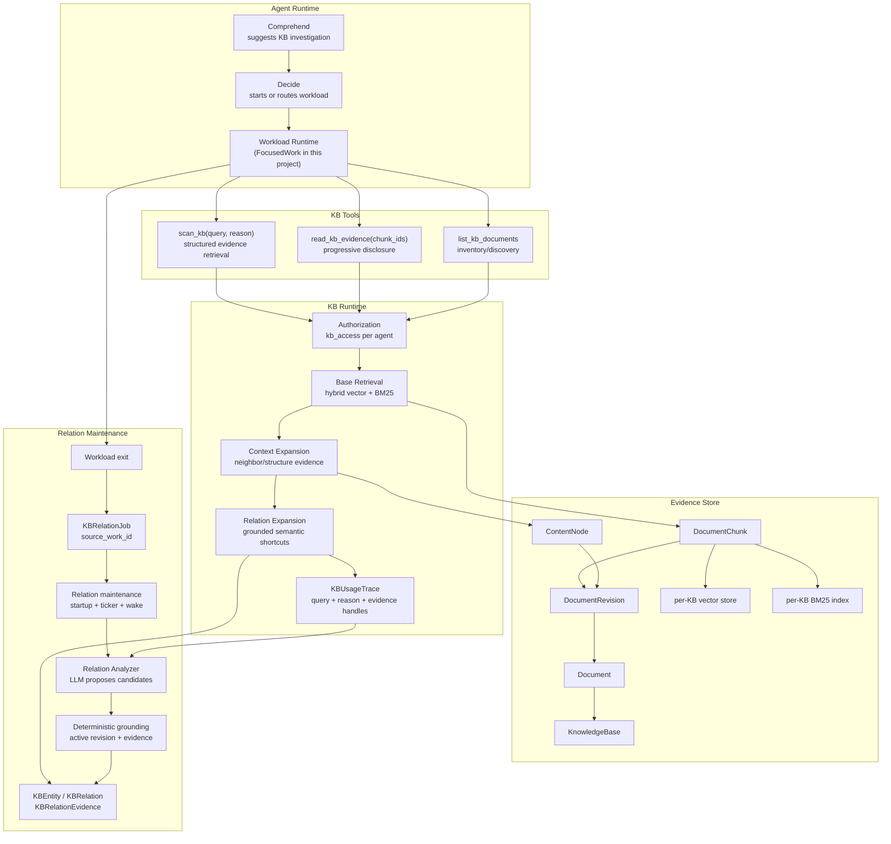
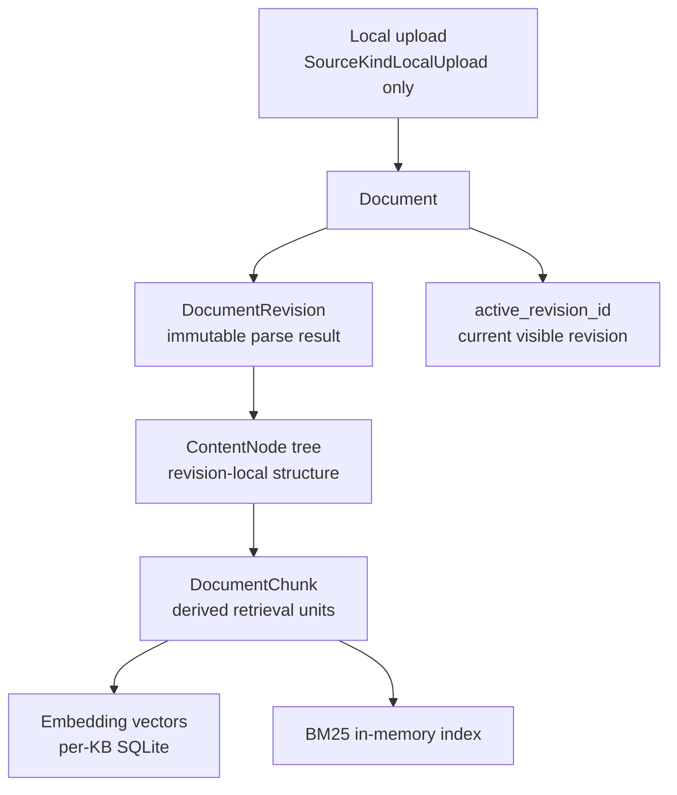
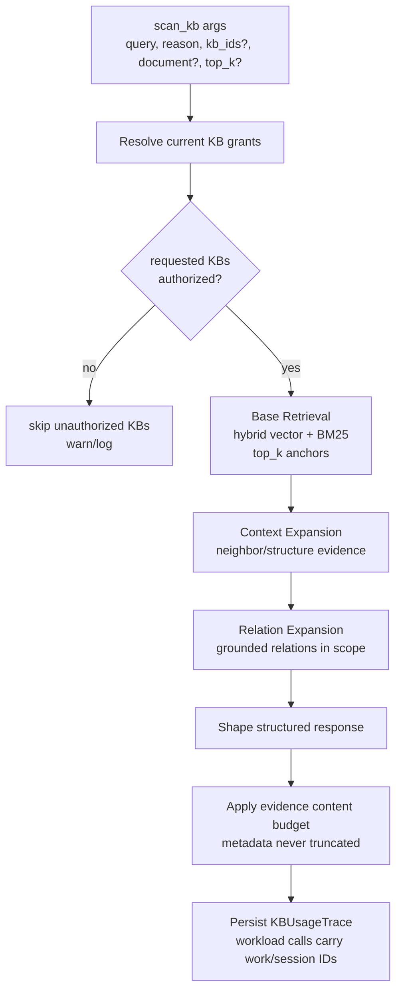
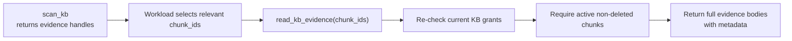
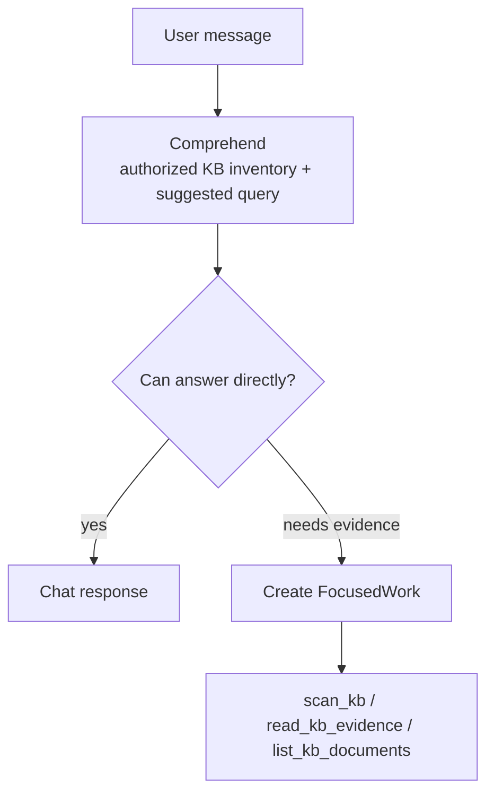
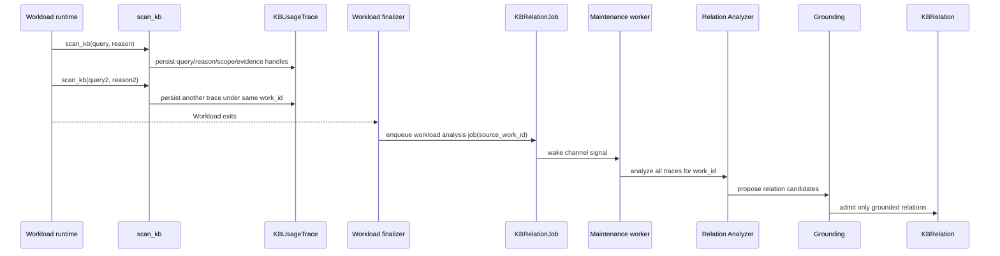
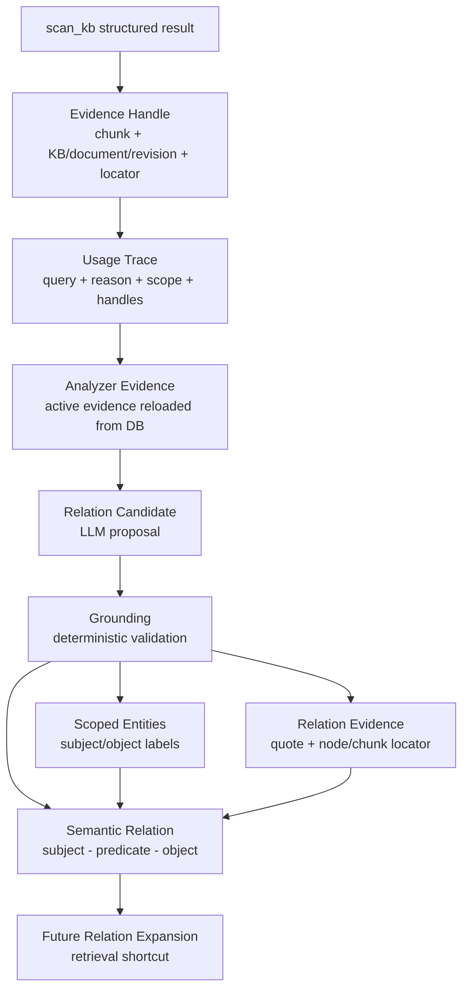
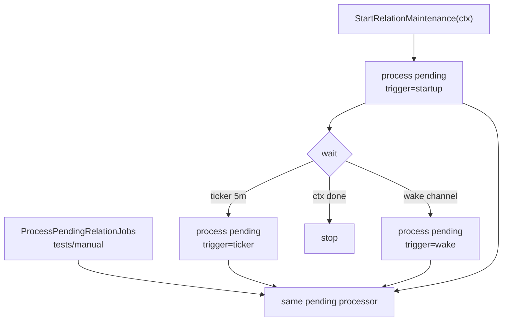

# Workload-driven Semantic RAG — Engineering Implementation

This document describes the 0.1.15 Workload-driven Semantic RAG architecture. The baseline is the main-branch naive RAG implementation: knowledge bases can be managed, local documents can be uploaded, and a query can retrieve matching chunks once. The current architecture extends that baseline into an evidence-governed RAG runtime whose semantic layer is built from real workload traces instead of global offline ontology construction.

The core rule is:

```text
The workload runtime owns task reasoning.
RAG owns evidence and semantic structure.
```

In this project, FocusedWork is the current workload producer. It decides why to search, what to search next, when to stop, and how to answer. The KB runtime provides authorized evidence retrieval, provenance, context expansion, relation expansion, and background relation maintenance. The RAG architecture itself is not coupled to the FocusedWork name; any runtime that records query intent, authorized scope, and returned evidence handles can feed the semantic layer.

## Architecture Overview



## Design Boundaries

### The workload runtime is the only task-level multi-step loop

The KB layer must not own a planner, frontier loop, or final-answer loop. It can traverse relations as retrieval, but it must not decide task strategy or synthesize task conclusions.

| Concern | Owner | Notes |
|---|---|---|
| Decide whether a task needs KB investigation | Agent runtime / workload runtime | Comprehend may suggest KB investigation, but the workload owns execution. |
| Issue multiple searches | Workload runtime | The agent calls `scan_kb` as many times as needed. |
| Explain final answer | Workload runtime | The answer is based on retrieved evidence and other task context. |
| Enforce KB authorization | KB tools / KB runtime | Every call resolves current grants. |
| Retrieve evidence | KB runtime | Hybrid retrieval + expansion. |
| Maintain provenance | KB runtime | Every evidence item carries KB, document, revision, node/chunk metadata. |
| Build semantic shortcuts | KB relation maintenance | Background process; never a user-facing answer generator. |

### `reason` is query intent, not chain-of-thought

`scan_kb` takes:

```text
query  = what to retrieve
reason = what knowledge gap this query is trying to fill
```

`reason` is stored in `KBUsageTrace` as workload context for later relation analysis. It is not KB evidence, not a truth source, and not a ranking score. It also cannot widen authorization.

### No user-facing KB search/reason HTTP API

The HTTP KB API remains management-only:

- create/update/delete knowledge bases
- upload/list/delete documents
- list/grant/revoke KB access
- update KB settings such as hybrid retrieval weight

Search and evidence reading are internal tools used by workload/private-space loops. This keeps KB investigation inside the agent runtime and avoids introducing a second public RAG surface.

## Document Ingestion and Canonical Evidence

The RAG runtime adds a canonical evidence layer above raw chunks:



### Data model roles

| Model | Role |
|---|---|
| `KnowledgeBase` | KB-level settings, counts, embedding/index status, hybrid retrieval ratio. |
| `Document` | Uploaded local file and lifecycle status. `active_revision_id` points to the visible revision. |
| `DocumentRevision` | Immutable parse/index version for one document processing attempt. |
| `ContentNode` | Canonical structural node inside one revision; node IDs are revision-local evidence anchors. |
| `DocumentChunk` | Retrieval unit derived from a revision/node; carries vector and BM25 searchable text. |
| `KBRelationEvidence` | Relation support bound to KB/document/revision/content-node/chunk plus locator and quote. |

`DocumentChunk` is optimized for retrieval. `ContentNode` and `DocumentRevision` are the canonical provenance layer. Relations and evidence must be grounded against active revisions, not loose text snippets.

### Source kinds

Only local upload is implemented. Remote URL/web/external data-source ingestion is intentionally out of scope for the current implementation.

### Active revision rule

Retrieval and relation expansion operate on the active revision only. When a document's active revision changes, relations supported by older revisions must stop participating in expansion by becoming stale or archived.

## Retrieval Pipeline

`scan_kb` is the primary retrieval tool. It returns structured evidence rather than a plain top-k chunk list.



### Base retrieval

Base retrieval produces anchor evidence. `top_k` limits this anchor set, not the final evidence count. The final response may include additional related evidence from context expansion and relation expansion.

Hybrid scoring combines vector and keyword retrieval:

```text
score = (1 - keyword_ratio) * vector_score + keyword_ratio * keyword_score
```

`keyword_ratio` is stored on `KnowledgeBase` and is applied by the retrieval service at query time.

### Context Expansion

Context Expansion adds nearby or structurally related evidence around anchors. It is retrieval support, not reasoning. It helps the agent see local context without forcing very large chunks.

### Relation Expansion

Relation Expansion uses traversable KB relations as semantic shortcuts. Current traversal uses `grounded` and `active` relations, starts from retrieved anchors, traverses shallow relation paths, and maps relation evidence back to authorized active chunks. It must not expose unauthorized KBs or stale evidence.

Each relation may carry an `applicability_note`, a natural-language boundary for the relation proposition. It is used to preserve limits such as time range, software version, project scope, jurisdiction, or source assumption. It is not a structured condition schema, not a confidence score, and not evidence; final answers still need to read the canonical evidence.

Final output audit applies to both evidence and relation path metadata. If an evidence item is blocked as unauthorized or non-active, any relation path that would reveal that blocked item is dropped or scrubbed. Relation-expanded evidence that is no longer covered by surviving relation paths is also removed, so expanded evidence and provenance stay aligned.

Relation traversal is not task planning. If more investigation is needed, the workload runtime calls `scan_kb` again.

### Structured response contract

`scan_kb` returns a structured JSON object with fields such as:

```json
{
  "status": 1,
  "outcome": "",
  "supported_conclusions": [],
  "logic": [],
  "related_documents": [],
  "related_evidence": [],
  "relation_paths": [],
  "evidence": [],
  "evidence_truncated": false,
  "truncation_notice": ""
}
```

The KB runtime intentionally leaves task-level conclusion fields empty. The workload runtime owns conclusions. The structure exists so metadata and evidence references survive tool-output budgeting.

### Truncation rule

Only evidence body text may be truncated. Metadata must not be truncated:

- KB ID
- document ID/title
- revision ID
- chunk ID
- locator JSON
- expansion kind
- relation path metadata
  - relation ID, subject, predicate, object, source/evidence chunk IDs
  - natural-language applicability note when one exists

When evidence body text is truncated, `truncation_notice` must tell the agent to use `read_kb_evidence` with returned chunk IDs for full content.

## Progressive Disclosure: `read_kb_evidence`

`read_kb_evidence` reads full active-revision evidence bodies by chunk ID. It exists because `scan_kb` may return many evidence handles while keeping body text bounded.



Important constraints:

- Authorization is checked at execution time, not cached from the earlier `scan_kb`.
- Missing, stale, deleted, or unauthorized chunks are reported as unavailable.
- The tool is a KB evidence reader, not a raw file reader.

## Project Integration: FocusedWork

### Comprehend and Decide

Chat comprehension may suggest that a KB investigation is needed, but it does not run a hidden multi-hop KB runtime. In this project, Decide can start FocusedWork when answering requires investigation.



### Workload tool contract

The workload prompt tells the agent:

- `scan_kb` is non-exhaustive semantic retrieval.
- Returned evidence is a subset, not proof of complete KB coverage.
- Each `scan_kb` call needs a short `reason`.
- Use `read_kb_evidence` when full evidence text is needed.
- Use `list_kb_documents` for KB inventory/discovery, not exhaustive search.

### Tool output protection

The workload loop has a generic hard output limit. KB tools must self-shape output before that layer so metadata survives. If a KB result is too large, evidence body text is reduced first; metadata and handles remain intact.

## Workload-driven Semantic Layer

The semantic relation layer is built from actual workload usage, not from global background scanning.



### Why workload-scoped jobs

One workload may call `scan_kb` multiple times. Relations often emerge across calls, not within a single call. Therefore job input is all KB usage traces under one `work_id`.

`scan_kb` does not enqueue relation jobs. Work finalization does.

Non-workload callers can use the same retrieval tools, but they do not create workload-scoped relation jobs. Relation analysis is keyed by `source_work_id`, so only work-scoped KB usage can become workload-driven semantic input.

### `KBUsageTrace`

For work-scoped calls, `KBUsageTrace` records:

- session/work identity
- query
- reason
- requested KB/document scope
- authorized KB scope
- returned evidence handles

It is an audit and analysis input. It is not evidence and does not grant access.

### Conceptual flow: evidence to semantic relation

The semantic layer is not built directly from documents and is not built from the agent's final answer. It is built from evidence that the workload actually used or saw during KB investigation.

Conceptually, one relation enters the system through this path:



The important distinction is that every layer has a different meaning:

| Layer | Meaning | Trusted as truth? | Final purpose |
|---|---|---:|---|
| Evidence handle | A stable reference returned by `scan_kb` | No, it is only a pointer | Lets the agent and background worker refer to the same evidence without copying full text |
| Usage trace | A record of one KB search inside a workload | No | Preserves what was searched, why it was searched, the visible KB scope, and which evidence was returned |
| Analyzer evidence | Evidence handles reloaded and rechecked against current DB state | Yes, as active KB evidence | Provides bounded, active evidence snippets to the analyzer |
| Relation candidate | Subject-predicate-object proposed by the LLM | No | Suggests a possible semantic shortcut |
| Grounded relation input | Candidate plus exact evidence handles and support quote after validation | Yes, if validation passes | Becomes the admission payload |
| Entity | A scope-bound lightweight label identity | Not by itself | Deduplicates subject/object labels inside one KB scope |
| Relation | A reusable semantic edge | Only because it has relation evidence | Lets future retrieval jump across evidence-supported semantic structure |
| Relation evidence | The proof anchor for a relation | Yes, as active KB evidence | Keeps the relation auditable and invalidatable |

#### Evidence handle

An evidence handle is the metadata part of a `scan_kb` result. It identifies a returned chunk and its provenance:

- KB ID
- document ID and title
- active revision ID
- chunk ID
- locator JSON
- expansion kind

The handle is deliberately separated from evidence body text. Body text may be truncated in tool output, but the handle must remain complete. Without the handle, later `read_kb_evidence` calls and background relation analysis would lose their addressable evidence path.

An evidence handle is not proof by itself. It is a pointer that must be rechecked when used.

#### Usage trace

A usage trace records one `scan_kb` call inside a workload. It contains:

- the search query
- the search reason
- the authorized KB scope at call time
- optional requested KB/document narrowing
- the returned evidence handles
- result shape and truncation status

The trace is useful because relation maintenance must know not only which chunks were returned, but also why the workload asked for them. The query and reason help the analyzer focus candidate extraction. They do not prove any relation.

This is also why relation jobs are enqueued at workload exit rather than during `scan_kb`: a single relation may only make sense after several searches in the same workload are considered together.

#### Analyzer evidence

Before the LLM sees anything, the background analyzer reloads each evidence handle from the database and rejects handles that are no longer valid:

- the chunk must still exist and not be deleted
- the document must still be ready
- the revision must still be the document's active revision
- the chunk must still map to a canonical content node

Only after this step does the system have analyzer evidence: bounded text plus active KB provenance. This is the first point where the background job can treat the item as current evidence rather than historical JSON.

#### Relation candidate

The analyzer asks the LLM for sparse relation candidates. A candidate contains:

- subject label
- predicate label
- object label
- cited chunk IDs
- exact support quote

This candidate is intentionally untrusted. The LLM is allowed to suggest useful structure, but it is not allowed to create facts. A candidate that cites an unseen chunk, omits a support quote, or uses a quote that does not appear exactly in cited evidence is rejected.

#### Grounding

Grounding is the deterministic admission boundary. The program checks:

- the cited chunk belongs to the analyzer evidence
- the support quote appears exactly in the cited evidence
- KB/document/revision/content-node/chunk IDs still resolve
- the revision is active
- the content hash matches when supplied

Only after grounding does the candidate become a relation admission payload.

This boundary is the key safety rule of the design:

```text
LLM proposes relation candidates.
Program decides whether evidence grounds them.
```

#### Scoped entity

An entity is a lightweight label identity inside a KB scope. It is not a global ontology node.

For example, the same label in two different authorized KB scopes may become two different entities. This prevents relation expansion from accidentally joining unrelated or unauthorized knowledge spaces.

Entities exist to deduplicate relation endpoints:

```text
scope + normalized label -> entity
```

They do not prove anything without relation evidence.

#### Semantic relation

A relation is the reusable semantic edge:

```text
subject entity --predicate--> object entity
```

The relation is scoped, idempotent, and lifecycle-managed. It becomes useful to retrieval only because it is attached to active relation evidence. Stale, rejected, or archived relations must not be used as retrieval shortcuts.

The predicate is open vocabulary. It is normalized for deduplication, but it is not a fixed enum and not a hard-coded ontology.

#### Relation evidence

Relation evidence is the proof anchor that makes a semantic edge auditable. It stores the active KB/document/revision/content-node/chunk path, locator, support quote, and content hash.

This is what allows later maintenance to answer:

- Which document supported this relation?
- Which revision and content node was used?
- What exact quote grounded it?
- Has the supporting evidence changed or disappeared?

When the underlying document revision changes or a document/KB is deleted, relation evidence is what lets the system mark affected relations stale, archived, or deleted.

#### Why this extra layer exists

Naive RAG can answer only from the chunks retrieved in the current call. Workload-driven Semantic RAG keeps evidence as the source of truth, but lets repeated workload usage gradually build reusable semantic shortcuts.

The shortcut never replaces evidence. It only helps future retrieval find related evidence faster:

```text
query -> anchor chunk -> grounded relation -> supporting chunks
```

The workload runtime still decides whether the expanded evidence is useful, whether another search is needed, and how to answer the user.

### Relation analysis

The analyzer can use the system LLM to propose candidates from workload traces and retrieved evidence. The analyzer only proposes; deterministic grounding and admission decide whether a candidate becomes reusable structure.

Admission is deterministic:

- evidence must resolve to existing KB/document/revision/node/chunk records
- evidence must belong to active, authorized KB scope
- support quote/content hash must ground the relation
- idempotency keys prevent duplicate relations

### Relation lifecycle

| State | Meaning |
|---|---|
| `candidate` | Proposed but not grounded. |
| `grounded` | Has valid supporting evidence. |
| `active` | Traversable relation state reserved for stricter future traversal-priority policy. |
| `stale` | Evidence changed or was deleted. |
| `rejected` | Failed grounding/admission. |
| `archived` | Retained for audit only. |

Current semantic expansion traverses both `grounded` and `active` relations. Fuller traversal-priority and maintenance-priority policies are intentionally left as later lifecycle refinements.

## Relation Maintenance Worker

Relation maintenance consumes explicit pending jobs only. It never scans all KB data on its own.



Wake signals use a buffered `chan struct{}` with capacity 1. Signals coalesce so runtime work never blocks if the worker is already awake or not started yet.

Job processing:

1. Load a bounded pending batch.
2. Atomically claim each pending job into running state.
3. Dispatch by job type:
   - analyze focus usage
   - revalidate stale relation
4. Mark completed or record failure.
5. Retry failed jobs up to the bounded attempt limit.

## Authorization and Isolation

Authorization is based on `kb_access`. Tools resolve the current grant set on every execution.

Rules:

- `scan_kb` only searches authorized KBs.
- Requested unauthorized KB IDs are skipped and logged.
- `read_kb_evidence` re-checks authorization for every requested chunk.
- Relation expansion cannot cross into unauthorized KB scope.
- Logs may record IDs/fingerprints/counts but must not leak unauthorized content.

## Deletion and Invalidation

KB deletion is an application-level cascade. Database foreign keys are intentionally not used.

The delete path must clean:

- in-memory vector/index managers
- BM25 index
- KB files
- access grants
- documents
- document revisions
- content nodes and chunk-node links
- document chunks
- usage traces referencing the KB
- relation jobs for affected workload work
- relation evidence
- relations
- orphan entities
- knowledge base row

Per-document deletion has separate business semantics. It must at least prevent deleted/stale evidence from participating in retrieval or relation expansion.

## Observability

Debug logs must allow a full workload-KB execution to be reconstructed without dumping full KB text.

Important log points:

- `scan_kb: retrieval started / completed`
- `scan_kb: KB usage trace persisted`
- missing reason warning
- unauthorized KB request warning
- context expansion counts
- relation expansion counts/path counts
- `read_kb_evidence: completed`
- relation job enqueue/wake/claim/complete/fail
- analyzer traces/evidence/candidate/admitted/rejected counts
- KB delete row counts
- BM25/vector index build/update events

Use fingerprints or short summaries for query/reason/body content. Production can disable debug logs, but the instrumentation points should exist.

## Engineering Constraints

- Non-test code must not use mocks.
- DB fields must be non-nullable.
- No database-level foreign keys; enforce constraints in application code.
- Enumerations stored on domain models use `type T int` style.
- Unexpected business states must log or return errors.
- New or subtle code paths need English comments.
- Do not add duplicate KB search surfaces; workload tools are the runtime interface.

## Known Boundaries

- Remote source kinds are not implemented.
- Relation traversal-priority and maintenance-priority policy is intentionally basic.
- Relation candidate quality depends on the system LLM, but truth/admission stays deterministic.
- Running-job crash recovery should be strengthened with a lease/recovery policy.
- KB relation traversal is shallow by design; the workload runtime should issue another `scan_kb` when the task needs another investigative step.
